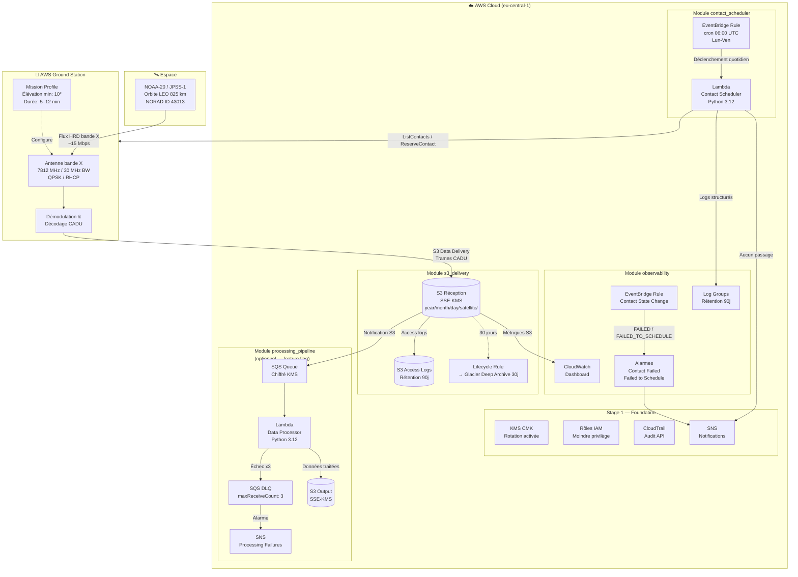
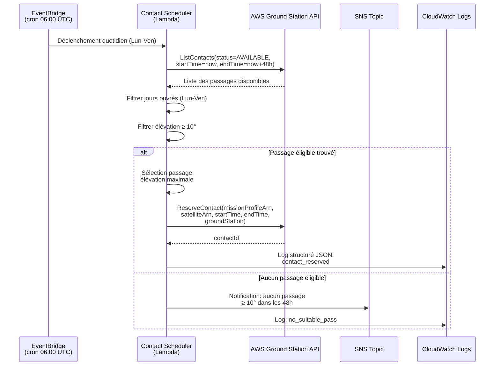
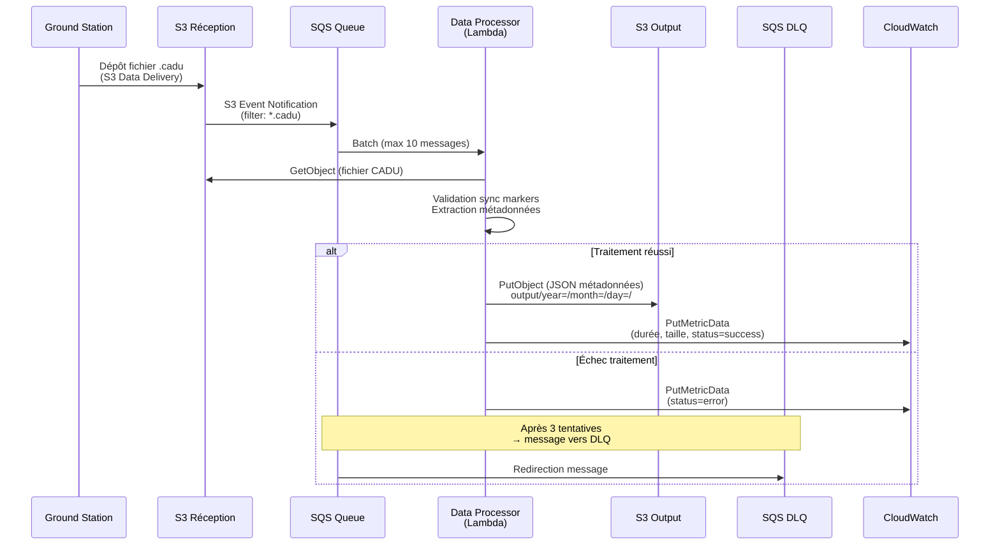

# Design Document — AWS Ground Control Demo

## Overview

Ce document décrit l'architecture de haut niveau du démonstrateur AWS Ground Station pour la réception de données NOAA-20 (JPSS-1). Le système est entièrement défini en Infrastructure as Code (Terraform) et déploie une chaîne complète : réception S3 Data Delivery → planification automatique des contacts → pipeline de traitement optionnel → observabilité et sécurité.

**Satellite cible** : NOAA-20 (NORAD ID 43013), orbite LEO héliosynchrone 825 km, flux HRD bande X (7812 MHz, 30 MHz BW, QPSK, RHCP).

**Région de déploiement** : `eu-central-1` (Frankfurt). Les contacts sont planifiés cross-région via les stations compatibles NOAA-20.

**Stations Ground Station disponibles pour NOAA-20** (vérifié 2026-06-18) :
- Cape Town 1 (`af-south-1`)
- Hawaii 1 (`us-west-2`)
- Ohio 1 (`us-east-2`)
- Oregon 1 (`us-west-2`)
- Stockholm 1 (`eu-north-1`) — station européenne la plus proche

⚠️ **Ireland 1 (`eu-west-1`) ne supporte PAS NOAA-20.** Les contacts sont planifiés cross-région depuis `eu-central-1`.

**Feature flags** :
- `ground_station_enabled` — contrôle la création du Mission Profile et des ressources Ground Station
- `enable_processing_pipeline` — contrôle l'activation du pipeline de traitement CADU

## Architecture

### Diagramme d'architecture système



### Diagramme de séquence — Planification d'un contact



### Diagramme de séquence — Traitement des données



## Components and Interfaces

### Structure modulaire Terraform

```
protogroundstation/
├── main.tf                          # Orchestration des modules
├── variables.tf                     # Variables d'entrée (région, feature flags)
├── outputs.tf                       # Sorties (ARN, noms, URLs)
├── terraform.tfvars                 # Valeurs par défaut
├── modules/
│   ├── security/                    # KMS, IAM, CloudTrail, SNS
│   ├── s3_delivery/                 # Bucket réception, logging, lifecycle
│   ├── mission_profile/             # Config Ground Station (awscc provider)
│   ├── contact_scheduler/           # Lambda + EventBridge cron
│   ├── processing_pipeline/         # SQS + Lambda + DLQ + S3 output
│   └── observability/               # Dashboard, alarmes, EventBridge rules
└── lambdas/
    ├── contact_scheduler/handler.py
    └── data_processor/handler.py
```

### Module `security`

| Ressource | Rôle |
|-----------|------|
| `aws_kms_key` | CMK avec rotation, politique autorisant Ground Station, CloudTrail, EventBridge |
| `aws_iam_role.groundstation` | Rôle de service pour S3 Data Delivery (PutObject, GetBucketLocation) |
| `aws_iam_role.scheduler_lambda` | Rôle Lambda scheduler (ListContacts, ReserveContact, SNS Publish, CloudWatch Logs) |
| `aws_iam_role.processor_lambda` | Rôle Lambda processor (S3 Get/Put, SQS, CloudWatch PutMetricData) — conditionnel |
| `aws_cloudtrail` | Audit de toutes les actions API dans la région |
| `aws_sns_topic.contact_notifications` | Topic SNS chiffré pour alertes opérationnelles |

### Module `s3_delivery`

| Ressource | Rôle |
|-----------|------|
| `aws_s3_bucket.reception` | Bucket principal recevant les trames CADU |
| Chiffrement SSE-KMS | Clé CMK du module security |
| Public Access Block | Blocage total de l'accès public |
| Versioning | Activé pour protection contre suppression accidentelle |
| Lifecycle Rule | Transition vers Glacier Deep Archive après 30 jours |
| Bucket Policy | Autorise `groundstation.amazonaws.com` à PutObject |
| Server Access Logging | Vers bucket dédié `*-access-logs-*` (rétention 90j) |
| CloudWatch Alarm | Alerte sur erreurs 4xx élevées |

### Module `mission_profile`

| Ressource | Rôle |
|-----------|------|
| `awscc_groundstation_config.tracking` | Configuration autotrack PREFERRED |
| `awscc_groundstation_config.antenna_downlink` | Bande X : 7812 MHz, 30 MHz BW, RHCP |
| `awscc_groundstation_config.s3_recording` | Endpoint S3 Data Delivery avec préfixe structuré |
| `awscc_groundstation_mission_profile` | Profil de mission liant tracking → antenne → S3 |

**Paramètres du Mission Profile** :
- Durée minimale viable : 300 secondes (5 min)
- Pre-pass : 120 secondes
- Post-pass : 120 secondes
- Dataflow edge : antenna_downlink → s3_recording

**Note** : Ce module utilise le provider `awscc` (AWS Cloud Control API) car les ressources Ground Station ne sont pas disponibles dans le provider `aws` standard.

### Module `contact_scheduler`

| Ressource | Rôle |
|-----------|------|
| `aws_lambda_function` | Python 3.12, 256 MB, timeout 60s |
| `aws_cloudwatch_event_rule` | Cron `0 6 ? * MON-FRI *` (06:00 UTC, jours ouvrés) |
| `aws_cloudwatch_log_group` | Rétention 90 jours |

**Logique du scheduler** :
1. Appel `ListContacts` (paginator) avec statut `AVAILABLE`, fenêtre now → now+48h
2. Filtrage : jours ouvrés uniquement (lundi–vendredi)
3. Filtrage : élévation maximale ≥ 10°
4. Sélection : passage avec élévation maximale
5. Appel `ReserveContact` avec le créneau sélectionné
6. Si aucun passage éligible : publication SNS + log warning

### Module `processing_pipeline` (conditionnel)

| Ressource | Rôle |
|-----------|------|
| `aws_sqs_queue.processing` | File d'attente avec visibility timeout 360s, chiffrement KMS |
| `aws_sqs_queue.dlq` | Dead Letter Queue (maxReceiveCount: 3) |
| `aws_s3_bucket_notification` | Notification sur `s3:ObjectCreated:*` filtre `.cadu` |
| `aws_lambda_function.data_processor` | Python 3.12, 512 MB, timeout 300s, batch SQS 10 |
| `aws_s3_bucket.output` | Bucket de sortie SSE-KMS |
| `aws_cloudwatch_metric_alarm.dlq_messages` | Alarme si messages dans DLQ |
| `aws_sns_topic.processing_failures` | Notifications d'échec |

**Logique du processor** :
1. Lecture du fichier CADU depuis S3
2. Validation des sync markers (0x1ACFFC1D) par trames de 1024 octets
3. Extraction métadonnées : frames valides/invalides, taux de synchronisation
4. Écriture JSON dans bucket output (`output/year=/month=/day=/`)
5. Publication métriques CloudWatch custom (durée, taille, statut)

### Module `observability`

| Ressource | Rôle |
|-----------|------|
| `aws_cloudwatch_dashboard` | 7 widgets : contacts planifiés/actifs/terminés/échoués, volume données, taux succès, coût estimé |
| `aws_cloudwatch_event_rule` | Capture événements Ground Station (FAILED, FAILED_TO_SCHEDULE) |
| `aws_cloudwatch_metric_alarm` × 2 | Alarmes sur contacts échoués |
| `aws_sns_topic.contact_failures` | Notifications d'échec de contact |
| `aws_cloudwatch_log_group` | Logs observabilité (rétention 90j) |

### Interfaces entre modules

```mermaid
flowchart LR
    subgraph Inputs["Variables d'entrée"]
        REGION[region]
        GS_FLAG[ground_station_enabled]
        PP_FLAG[enable_processing_pipeline]
        NORAD[satellite_norad_id]
    end

    subgraph SEC["security"]
        KMS_ARN[kms_key_arn]
        KMS_ID[kms_key_id]
        GS_ROLE[groundstation_role_arn]
        SCHED_ROLE[scheduler_role_arn]
        PROC_ROLE[processor_role_arn]
        SNS_ARN[sns_topic_arn]
    end

    subgraph S3D["s3_delivery"]
        BUCKET_ARN[bucket_arn]
        BUCKET_NAME[bucket_name]
    end

    subgraph MP["mission_profile"]
        MP_ARN[mission_profile_arn]
    end

    subgraph CS["contact_scheduler"]
        LOG_GRP[log_group_name]
    end

    subgraph PP["processing_pipeline"]
        OUT_ARN[output_bucket_arn]
    end

    subgraph OBS["observability"]
        DASH_URL[dashboard_url]
    end

    SEC -->|kms_key_arn| S3D
    SEC -->|groundstation_role_arn| MP
    SEC -->|scheduler_role_arn| CS
    SEC -->|processor_role_arn| PP
    SEC -->|sns_topic_arn| CS
    SEC -->|kms_key_id| PP
    SEC -->|kms_key_id| OBS

    S3D -->|bucket_arn| SEC
    S3D -->|bucket_arn| MP
    S3D -->|bucket_arn, bucket_name| PP
    S3D -->|bucket_name| OBS

    MP -->|mission_profile_arn| CS

    CS -->|log_group_name| OBS

    PP -->|output_bucket_arn| SEC
```



## Data Models

### Structure des objets S3 — Bucket de réception

```
s3://{project}-{env}-reception-{account_id}/
└── year={YYYY}/
    └── month={MM}/
        └── day={DD}/
            └── satellite={norad_id}/
                └── {contact_id}_{timestamp}.cadu
```

**Format des données** : Trames CADU (Channel Access Data Unit) brutes, standard CCSDS.
- Taille typique par contact : ~2 GB (10 min × 15 Mbps)
- Structure interne : trames de 1024 octets avec sync marker `0x1ACFFC1D`

### Structure des objets S3 — Bucket de sortie (pipeline)

```
s3://{project}-{env}-output-{account_id}/
└── output/
    └── year={YYYY}/
        └── month={MM}/
            └── day={DD}/
                └── {filename}.cadu.json
```

**Format de sortie** (JSON) :
```json
{
  "source_bucket": "groundstation-noaa20-demo-reception-471112743408",
  "source_key": "year=2025/month=05/day=22/satellite=43013/contact-abc123.cadu",
  "processed_at": "2025-05-22T14:30:00+00:00",
  "metadata": {
    "total_bytes": 2147483648,
    "valid_frames": 2097152,
    "invalid_frames": 0,
    "sync_markers_found": 2097152,
    "frame_sync_rate": 1.0,
    "validation_status": "valid"
  },
  "input_size_bytes": 2147483648
}
```

### Variables Terraform — Modèle d'entrée

| Variable | Type | Défaut | Description |
|----------|------|--------|-------------|
| `region` | string | — | Région AWS (validée contre liste GS) |
| `environment` | string | `"demo"` | Nom d'environnement |
| `project_name` | string | `"groundstation-noaa20"` | Préfixe de nommage |
| `ground_station_enabled` | bool | `false` | Active le Mission Profile |
| `enable_processing_pipeline` | bool | `false` | Active le pipeline de traitement |
| `satellite_norad_id` | number | `43013` | NORAD ID du satellite cible |
| `aws_profile` | string | `null` | Profil AWS CLI |
| `tags` | map(string) | `{}` | Tags additionnels |

### Outputs Terraform

| Output | Source | Description |
|--------|--------|-------------|
| `mission_profile_arn` | module.mission_profile | ARN du profil de mission (si activé) |
| `reception_bucket_name` | module.s3_delivery | Nom du bucket de réception |
| `reception_bucket_arn` | module.s3_delivery | ARN du bucket de réception |
| `sns_topic_arn` | module.security | ARN du topic SNS notifications |
| `dashboard_url` | module.observability | URL du tableau de bord CloudWatch |
| `kms_key_arn` | module.security | ARN de la clé KMS |

### Cycle de vie des données

| Phase | Stockage | Rétention | Chiffrement |
|-------|----------|-----------|-------------|
| Réception brute | S3 Standard | 30 jours | SSE-KMS (CMK) |
| Archive | S3 Glacier Deep Archive | Indéfinie | SSE-KMS (CMK) |
| Données traitées | S3 Standard (output) | Indéfinie | SSE-KMS (CMK) |
| Logs d'accès S3 | S3 Standard (logging) | 90 jours | AES-256 |
| Logs CloudWatch | CloudWatch Logs | 90 jours | — |
| Logs CloudTrail | S3 (cloudtrail bucket) | Indéfinie | SSE-KMS (CMK) |

## Error Handling

### Contact Scheduler — Gestion des erreurs

| Scénario | Comportement | Notification |
|----------|-------------|--------------|
| Mission Profile non configuré (`ground_station_enabled=false`) | Retour immédiat `scheduled: false` | Log warning uniquement |
| Erreur API `ListContacts` | Exception propagée → Lambda retry | CloudWatch Logs (ERROR) |
| Aucun passage éligible (élévation < 10°) | Publication SNS | SNS + CloudWatch Logs |
| Erreur API `ReserveContact` | Exception propagée → Lambda retry | CloudWatch Logs (ERROR) |
| Erreur publication SNS | Exception propagée | CloudWatch Logs (ERROR) |

### Data Processor — Gestion des erreurs

| Scénario | Comportement | Notification |
|----------|-------------|--------------|
| Erreur lecture S3 (GetObject) | Métrique `status=error`, message reste dans SQS | CloudWatch custom metric |
| Fichier CADU trop court (< 1024 octets) | Traitement avec `validation_status: too_short` | Log info (pas d'erreur) |
| Aucun sync marker trouvé | Traitement avec `validation_status: no_sync` | Log info |
| Erreur écriture S3 (PutObject) | Métrique `status=error`, message reste dans SQS | CloudWatch custom metric |
| 3 échecs consécutifs | Message redirigé vers DLQ | Alarme CloudWatch → SNS |

### Infrastructure — Alarmes et notifications

| Alarme | Condition | Action |
|--------|-----------|--------|
| `s3-errors` | > 10 erreurs 4xx en 5 min | — (pas d'action SNS configurée) |
| `contact-failed` | ContactStatus = FAILED | SNS → contact_failures |
| `contact-failed-to-schedule` | ContactStatus = FAILED_TO_SCHEDULE | SNS → contact_failures |
| `dlq-messages` | Messages visibles > 0 dans DLQ | SNS → processing_failures |

## Testing Strategy

### Approche de test pour Infrastructure as Code

Ce projet étant entièrement basé sur Terraform (IaC), les tests property-based ne sont **pas applicables**. L'infrastructure est déclarative — il n'y a pas de fonctions avec entrées/sorties variables à tester par génération aléatoire.

**Pourquoi PBT ne s'applique pas ici** :
- Terraform est une configuration déclarative, pas du code impératif
- Les ressources AWS sont créées de manière déterministe à partir de la configuration
- Il n'y a pas d'espace d'entrée variable à explorer (les variables sont fixées au déploiement)
- Les Lambdas interagissent avec des services externes (AWS Ground Station, S3, SQS) — les tests d'intégration sont plus appropriés

### Stratégie de test recommandée

#### 1. Validation Terraform (CI/CD)

```bash
terraform fmt -check -recursive
terraform validate
terraform plan -out=plan.tfplan
```

#### 2. Tests Terraform natifs (`.tftest.hcl`)

Tests de plan-only pour valider la configuration sans déployer :
- Validation des variables (région supportée, NORAD ID)
- Vérification de la structure des modules
- Vérification des feature flags (resources conditionnelles)
- Vérification des outputs

#### 3. Sécurité — Checkov

```bash
checkov -d . --quiet --download-external-modules false
```

Vérifications clés :
- Chiffrement S3 (SSE-KMS)
- Blocage accès public S3
- Rotation KMS activée
- CloudTrail activé
- Logs Lambda avec rétention définie

#### 4. Tests unitaires Python (Lambdas)

| Lambda | Framework | Approche |
|--------|-----------|----------|
| `contact_scheduler` | pytest + moto | Mock AWS Ground Station API (pas supporté par moto → unittest.mock) |
| `data_processor` | pytest + moto | Mock S3 avec moto, validation logique CADU |

Tests prioritaires :
- Filtrage des contacts par jour ouvré
- Sélection du passage avec élévation maximale
- Comportement quand aucun passage éligible
- Validation des sync markers CADU
- Calcul du frame_sync_rate
- Gestion des fichiers trop courts

#### 5. Tests d'intégration (post-déploiement)

- Invocation manuelle du scheduler avec `ground_station_enabled=false` → vérification du retour gracieux
- Dépôt d'un fichier `.cadu` de test dans le bucket → vérification du pipeline SQS → Lambda → S3 output
- Vérification du tableau de bord CloudWatch accessible
- Vérification des alarmes configurées

#### 6. Smoke tests

- `terraform output` retourne les valeurs attendues
- Les buckets S3 existent et sont chiffrés
- Les Lambda functions sont déployées et invocables
- Le CloudWatch Dashboard est accessible

