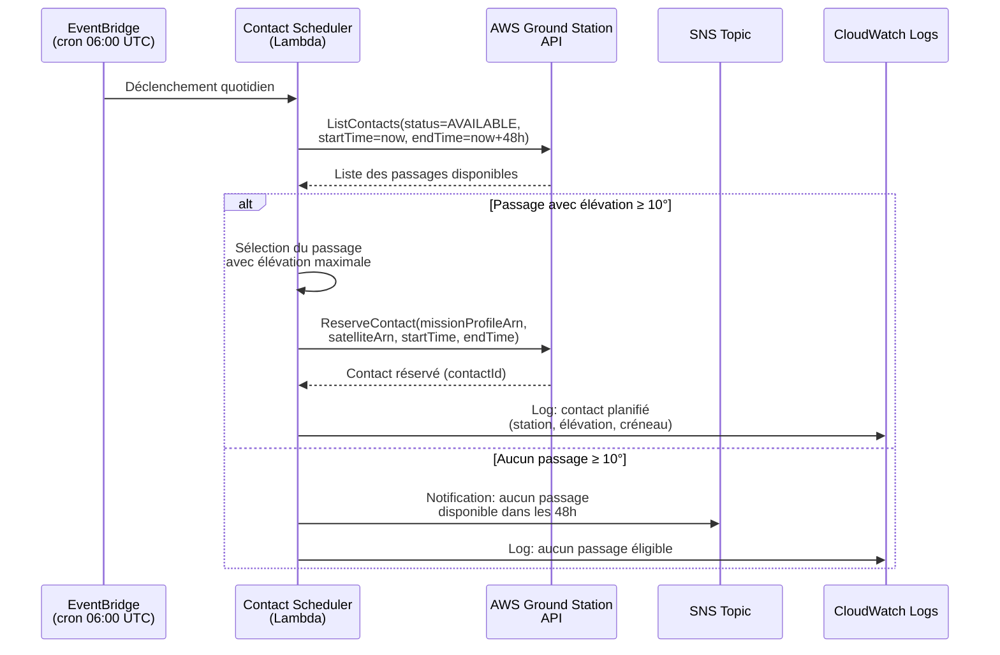
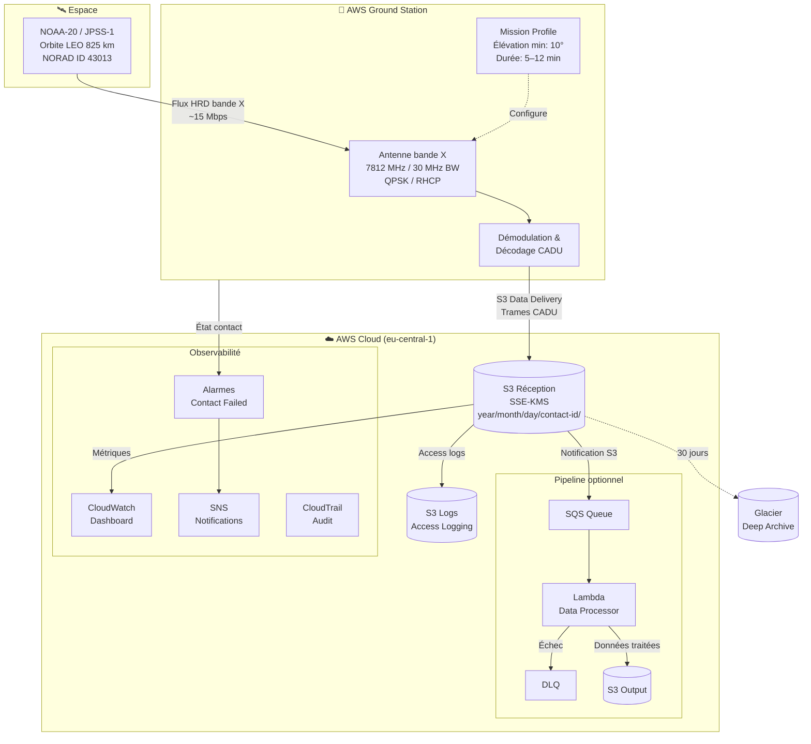
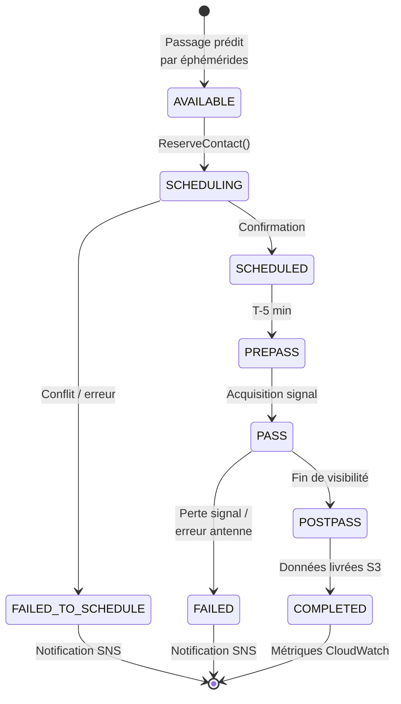

# Requirements Document

## Introduction

Démonstration de AWS Ground Station — un prototype d'infrastructure Terraform qui met en place les composants nécessaires pour planifier des contacts avec le satellite public **NOAA-20 (JPSS-1)**, recevoir des données d'imagerie Earth Observation via S3 Data Delivery, et optionnellement déclencher un pipeline de traitement. NOAA-20 est un satellite d'observation terrestre en orbite polaire héliosynchrone basse (LEO, 825 km) équipé de l'instrument VIIRS (Visible Infrared Imaging Radiometer Suite) qui fournit des images météorologiques et environnementales. Son flux HRD (High Rate Data) en bande X est accessible publiquement sans licence.

### Contexte radio et enjeux techniques

**Bande X (7750–8400 MHz)** : Utilisée par NOAA-20 pour le flux HRD (High Rate Data). La bande X offre un débit élevé (~15 Mbps pour NOAA-20) permettant de transmettre l'intégralité des données VIIRS en temps réel pendant un passage. L'enjeu principal est la courte fenêtre de visibilité (8–12 minutes par passage) pendant laquelle toutes les données doivent être descendues. AWS Ground Station gère la démodulation QPSK et le décodage, livrant directement les trames CADU (Channel Access Data Unit) dans S3.

**Bande S (2200–2300 MHz)** : Utilisée pour la télémétrie et le contrôle (TT&C) des satellites. Débit plus faible (~128 kbps) mais suffisant pour les commandes et la santé du satellite. Non utilisée dans cette démonstration car NOAA-20 est un satellite public — nous n'avons pas besoin d'envoyer de commandes.

**S3 Data Delivery vs EC2 Dataflow Endpoint** : AWS Ground Station propose deux modes de livraison. S3 Data Delivery est plus simple (pas de VPC, pas d'instance EC2 à gérer) et suffisant pour la réception de données descendantes. Le mode EC2 est nécessaire uniquement pour l'uplink (commandes) ou le traitement en temps réel pendant le contact.

### Estimation budgétaire

| Composant | Coût estimé (par contact) | Hypothèse |
|-----------|--------------------------|-----------|
| Antenne Ground Station (narrowband, on-demand) | ~$10/min × 10 min = **$100** | 1 contact de 10 min en bande X narrowband (<40 MHz) |
| Antenne Ground Station (narrowband, reserved) | ~$3/min × 10 min = **$30** | Avec engagement mensuel 12 mois |
| Stockage S3 (données brutes) | ~$0.02/GB | ~2 GB par contact NOAA-20 |
| Lambda de traitement (optionnel) | ~$0.01 | Invocation unique par contact |
| CloudWatch (logs + métriques) | ~$1/mois | Rétention 90 jours |
| **Total estimé par contact (on-demand)** | **~$100–110** | Sans engagement |
| **Total estimé par contact (reserved)** | **~$30–35** | Avec engagement mensuel |

**Recommandation** : Pour une démonstration, prévoir 2–3 contacts on-demand (~$300–330 total) pour valider le pipeline de bout en bout avant de s'engager sur un volume réservé.

## Glossary

- **Ground_Station_System**: L'ensemble de l'infrastructure AWS déployée par Terraform pour la démonstration AWS Ground Station avec NOAA-20
- **Mission_Profile**: Configuration AWS Ground Station définissant les paramètres de communication pour le flux HRD de NOAA-20 (bande X, 7812 MHz, démodulation QPSK)
- **Contact**: Réservation d'un créneau temporel sur une antenne AWS Ground Station pour communiquer avec NOAA-20 lors de son passage (durée typique : 8–12 minutes)
- **Dataflow_Endpoint**: Point de terminaison S3 recevant les données descendantes brutes (trames CADU) du satellite
- **NOAA_20**: Satellite JPSS-1 de la NOAA en orbite polaire héliosynchrone à 825 km, portant l'instrument VIIRS pour l'imagerie terrestre. NORAD ID : 43013
- **VIIRS_Data**: Données d'imagerie produites par l'instrument Visible Infrared Imaging Radiometer Suite à bord de NOAA-20
- **CADU**: Channel Access Data Unit — format de trame standard (CCSDS) encapsulant les données descendantes du satellite
- **Data_Pipeline**: Pipeline de traitement optionnel déclenché par l'arrivée de données CADU dans S3
- **Contact_Scheduler**: Composant automatisant la planification des contacts en fonction des passages prédits de NOAA-20
- **Contact_Dashboard**: Interface CloudWatch de suivi des contacts planifiés et exécutés, avec métriques de qualité

## Schémas fonctionnels

### Planification des contacts

### Profil de mission et flux de données

### Cycle de vie d'un contact

## Requirements

> **Convention de rédaction** : Les critères d'acceptation suivent le standard EARS (Easy Approach to Requirements Syntax) conforme aux règles de qualité INCOSE. Les mots-clés en majuscules anglaises sont des marqueurs normatifs :
> - `THE` + nom du système = sujet de l'exigence
> - `SHALL` = obligation (verbe modal normatif)
> - `WHEN` = déclencheur événementiel
> - `IF ... THEN` = gestion d'erreur ou événement indésirable
> - `WHERE` = fonctionnalité optionnelle
> - `WHILE` = condition d'état
>
> Le reste du texte est rédigé en français.

### Requirement 1: Infrastructure de réception S3 Data Delivery

**User Story:** En tant qu'ingénieur satellite, je veux disposer d'un bucket S3 correctement configuré pour recevoir les données descendantes de NOAA-20 via S3 Data Delivery, afin d'éviter la complexité d'une instance EC2 réceptrice et de bénéficier d'un stockage durable et scalable.

#### Acceptance Criteria

1. THE Ground_Station_System SHALL créer un bucket S3 chiffré (SSE-KMS) dédié à la réception des trames CADU brutes de NOAA-20
2. THE Ground_Station_System SHALL configurer la politique du bucket pour autoriser le service AWS Ground Station (`groundstation.amazonaws.com`) à y déposer des objets
3. THE Ground_Station_System SHALL organiser les données reçues de manière structurée par date et identifiant de contact
4. THE Ground_Station_System SHALL configurer une règle de cycle de vie S3 pour archiver les données vers Glacier Deep Archive après 30 jours
5. IF le bucket S3 de réception est inaccessible lors d'un contact, THEN THE Ground_Station_System SHALL émettre une alarme CloudWatch

### Requirement 2: Configuration du profil de mission NOAA-20 (bande X)

**User Story:** En tant qu'ingénieur satellite, je veux définir un profil de mission configuré pour le flux HRD (High Rate Data) de NOAA-20 en bande X, afin de pouvoir planifier des contacts et recevoir des données VIIRS complètes pendant chaque passage.

#### Acceptance Criteria

1. THE Ground_Station_System SHALL créer un Mission_Profile configuré pour la réception du flux HRD de NOAA-20 avec les paramètres suivants : bande X, fréquence centrale 7812 MHz, largeur de bande 30 MHz, modulation QPSK, polarisation RHCP
2. THE Ground_Station_System SHALL définir une configuration de tracking avec un angle d'élévation minimum de 10 degrés pour garantir un rapport signal/bruit suffisant
3. THE Ground_Station_System SHALL associer le Mission_Profile à un Dataflow_Endpoint de type S3 Data Delivery pointant vers le bucket de réception
4. THE Ground_Station_System SHALL configurer la durée minimale de contact à 5 minutes et la durée maximale à 12 minutes
5. WHEN NOAA-20 est enregistré (onboarded) dans le compte AWS via la console Ground Station, THE Ground_Station_System SHALL permettre la planification de contacts via le Mission_Profile

### Requirement 3: Planification automatique des contacts

**User Story:** En tant qu'opérateur, je veux que les contacts avec NOAA-20 soient planifiés automatiquement en fonction des passages prédits au-dessus des stations au sol disponibles, afin de maximiser les opportunités de réception sans intervention manuelle.

#### Acceptance Criteria

1. THE Contact_Scheduler SHALL interroger l'API AWS Ground Station (`ListContacts` avec statut `AVAILABLE`) pour identifier les créneaux de passage de NOAA-20 dans les prochaines 48 heures
2. THE Contact_Scheduler SHALL planifier automatiquement un contact par jour ouvré (du lundi au vendredi) en sélectionnant le passage avec l'élévation maximale
3. THE Contact_Scheduler SHALL être déclenché automatiquement chaque jour à 06:00 UTC
4. IF aucun passage disponible ne dépasse l'angle d'élévation minimum de 10 degrés dans les prochaines 48 heures, THEN THE Contact_Scheduler SHALL émettre une notification SNS informant l'opérateur
5. THE Contact_Scheduler SHALL enregistrer chaque planification (créneau choisi, station au sol, élévation maximale) dans les logs CloudWatch

### Requirement 4: Pipeline de traitement des données (optionnel)

**User Story:** En tant qu'ingénieur données, je veux pouvoir activer un pipeline de traitement qui convertit les données CADU brutes en fichiers exploitables, afin de démontrer la chaîne complète de la réception à l'exploitation.

#### Acceptance Criteria

1. WHERE le pipeline de traitement est activé, THE Data_Pipeline SHALL déclencher automatiquement un traitement à chaque nouveau fichier CADU déposé dans le bucket de réception
2. WHERE le pipeline de traitement est activé, THE Data_Pipeline SHALL stocker les données traitées dans un espace de stockage de sortie distinct, organisé par date
3. IF le traitement échoue, THEN THE Data_Pipeline SHALL rediriger le message vers une file DLQ (Dead Letter Queue) et émettre une notification SNS
4. WHERE le pipeline de traitement est activé, THE Data_Pipeline SHALL enregistrer les métriques de traitement (durée, taille des données brutes, statut) dans CloudWatch
5. WHERE le pipeline de traitement est désactivé, THE Ground_Station_System SHALL uniquement stocker les données brutes dans le bucket de réception sans traitement supplémentaire

### Requirement 5: Observabilité et suivi des contacts

**User Story:** En tant qu'opérateur, je veux visualiser l'état des contacts planifiés et passés avec NOAA-20, afin de surveiller la santé opérationnelle du système et la qualité des données reçues.

#### Acceptance Criteria

1. THE Ground_Station_System SHALL créer un tableau de bord CloudWatch affichant les métriques de contacts (planifiés, en cours, terminés, échoués)
2. WHEN un contact se termine avec un statut d'échec (`FAILED` ou `FAILED_TO_SCHEDULE`), THE Ground_Station_System SHALL envoyer une notification via SNS
3. THE Ground_Station_System SHALL conserver les logs de contact et du scheduler pendant 90 jours minimum
4. THE Ground_Station_System SHALL exposer les métriques suivantes dans le tableau de bord : nombre de contacts par jour, volume de données reçues (octets), taux de succès des contacts, coût cumulé estimé

### Requirement 6: Sécurité et contrôle d'accès

**User Story:** En tant que responsable sécurité, je veux que l'infrastructure respecte le principe du moindre privilège et les bonnes pratiques AWS Well-Architected, afin de limiter la surface d'attaque.

#### Acceptance Criteria

1. THE Ground_Station_System SHALL créer des rôles IAM dédiés avec des politiques de moindre privilège pour chaque composant (Lambda scheduler, Lambda traitement, service Ground Station, accès S3)
2. THE Ground_Station_System SHALL chiffrer toutes les données au repos avec des clés KMS gérées par le client (CMK)
3. THE Ground_Station_System SHALL activer CloudTrail pour auditer toutes les actions API liées à Ground Station dans la région de déploiement
4. THE Ground_Station_System SHALL bloquer tout accès public aux buckets de stockage
5. IF une tentative de suppression d'objet est détectée sur le bucket de réception, THEN THE Ground_Station_System SHALL journaliser l'événement via S3 Server Access Logging

### Requirement 7: Déploiement et reproductibilité

**User Story:** En tant qu'ingénieur DevOps, je veux que l'ensemble de l'infrastructure soit déployable en une seule commande Terraform, afin de pouvoir reproduire la démonstration dans différents comptes et régions supportant AWS Ground Station.

#### Acceptance Criteria

1. THE Ground_Station_System SHALL être entièrement défini en modules Terraform réutilisables
2. THE Ground_Station_System SHALL accepter la région de déploiement comme variable d'entrée, validée contre la liste des régions supportant AWS Ground Station (us-east-2, us-west-2, eu-north-1, me-south-1, ap-southeast-2, af-south-1, eu-west-1, eu-central-1, sa-east-1, us-east-1)
3. THE Ground_Station_System SHALL valider que le satellite NOAA-20 (NORAD ID 43013) est enregistré dans le compte via une précondition Terraform ou un data source
4. WHEN la commande `terraform apply` est exécutée, THE Ground_Station_System SHALL provisionner l'ensemble de l'infrastructure en moins de 10 minutes
5. THE Ground_Station_System SHALL produire en sortie les identifiants des ressources créées (ARN du Mission_Profile, nom des buckets S3, ARN du topic SNS, URL du tableau de bord CloudWatch)
