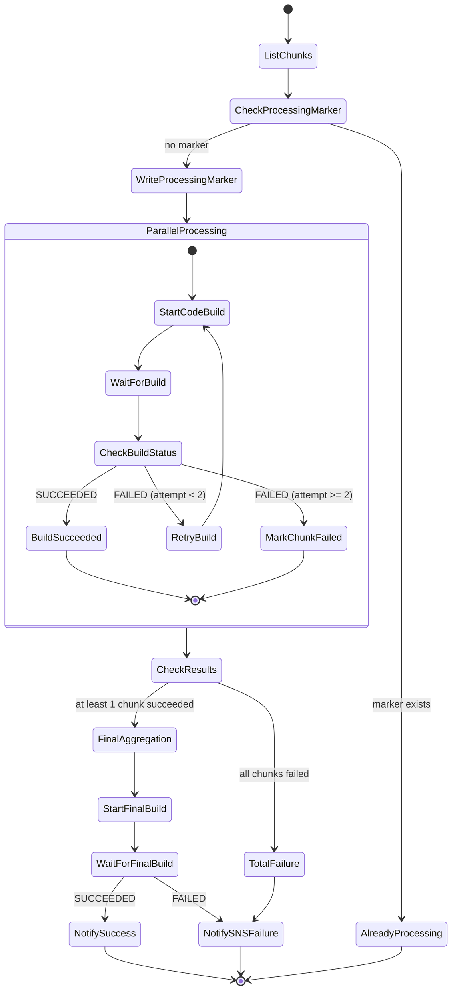

# Design Document: NOAA-20 DigIF to SDR Pipeline

## Overview

Pipeline de traitement automatisé convertissant les fichiers DigIF bruts (VITA-49 dans .pcap) reçus via AWS Ground Station S3 Data Delivery en fichiers SDR + GEO (HDF5 Level 1) calibrés et géolocalisés. La sortie alimente le spec aval `noaa20-viirs-visualization`.

### Chaîne de traitement complète

```
Per chunk (parallel):
  .pcap (VITA-49 DigIF) → Extraction I/Q (.cs8) → SatDump npp_hrd (.cadu + composites PNG)
  → Upload composites + CADU to S3

Aggregation (single, after all chunks):
  Download all .cadu → Concatenate → RT-STPS 7.0 (jpss1.xml) → RDR HDF5
  → CSPP SDR 4.1.1 → SDR + GEO HDF5 Level 1
```

### Key Fixes Applied

- **`jpss1.xml` (not `npp.xml`) for NOAA-20** — `npp.xml` is for S-NPP satellite. NOAA-20 is JPSS-1 and requires `jpss1.xml` configuration.
- **`/opt/rt-stps/data/` is the actual RDR output path** — `batch.sh` cd's to its own directory (`/opt/rt-stps/`), so the `../data` relative path in the XML config resolves to `/opt/rt-stps/data/`, not relative to the caller's cwd.
- **CADU concatenation required** — A single 30-second chunk produces insufficient data for RT-STPS to form a complete VIIRS granule (~85 seconds of data needed). All chunks' `.cadu` files must be concatenated into a single stream before feeding to RT-STPS.
- **`.cadu` files must be uploaded to S3 per-chunk** — The aggregation step downloads and concatenates them. The per-chunk buildspec must NOT exclude `.cadu` from the S3 sync.

### Décisions de conception clés

1. **CodeBuild comme compute principal** — EC2 bloqué par SCP organisationnelle. CodeBuild `BUILD_GENERAL1_LARGE` (8 vCPU, 16 GB RAM, 240 GB disque) offre suffisamment de ressources pour chaque étape.

2. **Un build CodeBuild par chunk** — Chaque chunk de 2.18 GB est traité indépendamment. 19 builds parallèles traitent un contact complet en ~15 min par chunk, 60 min total.

3. **Docker image unique multi-outils** — Une seule image contenant Python extractor, SatDump v1.2.0, RT-STPS, et CSPP SDR. Simplifie l'orchestration (pas de transferts S3 intermédiaires entre étapes).

4. **Orchestration Step Functions + Map state fan-out** — Step Functions Standard orchestre le pipeline : un Map state lance N builds CodeBuild en parallèle (un par chunk), puis un dernier CodeBuild agrège les résultats.

5. **Traitement séquentiel avec upload intermédiaire dans chaque build** — À l'intérieur d'un build CodeBuild, les étapes s'exécutent séquentiellement : extraction → SatDump → **upload composites to S3** → RT-STPS → CSPP → upload SDR/GEO. Les composites SatDump sont uploadés immédiatement après SatDump, indépendamment du succès de RT-STPS/CSPP. Cela garantit que les composites sont disponibles dans S3 même si la chaîne NASA (RT-STPS/CSPP) échoue.

6. **Déclenchement direct S3 → EventBridge → Step Functions** — Pas de Lambda orchestratrice ni de SQS intermédiaire. EventBridge rule capte l'événement S3 ObjectCreated et démarre directement l'exécution Step Functions.

7. **Idempotence via execution name Step Functions** — L'execution name = `contact_id`. Step Functions rejette automatiquement les exécutions dupliquées (même nom dans une fenêtre de 90 jours). S3 marker comme vérification secondaire.

8. **Géolocalisation + manifeste dans un CodeBuild final** — Pas de Lambda post-processing séparée. Un dernier CodeBuild agrège les résultats, calcule la géolocalisation, et génère le manifest.json.

9. **Contrat de sortie strict** — Les fichiers SDR + GEO produits respectent les patterns de nommage NOAA standard, permettant au spec aval de les consommer sans transformation.

### Caractéristiques de performance mesurées

| Étape | Durée par chunk | Ressources |
|-------|-----------------|------------|
| Extraction I/Q (Python) | ~8 secondes | CPU-bound, faible RAM |
| SatDump npp_hrd | ~5 minutes | CPU-bound, ~4 GB RAM |
| RT-STPS | ~2 minutes | I/O + CPU |
| CSPP SDR | ~5 minutes | CPU-bound, ~8 GB RAM |
| **Total par chunk** | **~13 minutes** | BUILD_GENERAL1_LARGE |
| **Contact complet (19 chunks)** | **~15 min (parallélisé)** | 19 builds concurrents |

## Architecture

```mermaid
flowchart TD
    A[S3: Reception Bucket<br/>aws-groundstation-demo-reception-471112743408<br/>.pcap files — VITA-49 DigIF] -->|S3 ObjectCreated event| B[EventBridge Rule<br/>filter: prefix + suffix .pcap]
    B -->|StartExecution<br/>name = contact_id| C[Step Functions Standard:<br/>SDR Pipeline]

    C --> D[Map State: Parallel Processing<br/>Concurrency: 19]

    D --> E[CodeBuild: Chunk Processing<br/>BUILD_GENERAL1_LARGE<br/>Docker image multi-outils]

    subgraph CodeBuild Job — per chunk
        E --> E1[Step 1: I/Q Extraction<br/>pcap → .cs8<br/>Python script, ~8s]
        E1 --> E2[Step 2: SatDump npp_hrd<br/>.cs8 → .cadu + composites<br/>~5 min]
        E2 --> E2b[Step 2b: Upload SatDump composites<br/>PNG + product.cbor → S3<br/>always succeeds]
        E2b --> E3[Step 3: RT-STPS<br/>.cadu → RDR HDF5<br/>~2 min — may fail]
        E3 --> E4[Step 4: CSPP SDR<br/>RDR → SDR + GEO HDF5<br/>~5 min — may fail]
        E4 --> E5[Upload SDR + GEO to S3]
    end

    E5 --> F[Final CodeBuild: Aggregation<br/>Geolocation + Manifest + Metrics]
    F --> G[S3: Output Bucket<br/>SDR + GEO + manifest.json]
    F --> H[CloudWatch Metrics]

    C -->|On failure| I[SNS: Failure Notification]
```

### Position dans l'infrastructure existante

| Ressource existante | Utilisation |
|---|---|
| `module.s3_delivery` (reception bucket) | Source — .pcap DigIF déposés par Ground Station |
| `module.security` (KMS CMK) | Chiffrement au repos des sorties |
| `module.security` (SNS topic) | Notifications d'échec du pipeline |

### Nouvelles ressources AWS

| Ressource | Objectif |
|---|---|
| EventBridge Rule | Capte S3 ObjectCreated pour les .pcap, démarre Step Functions |
| Step Functions State Machine | Orchestre le pipeline complet (fan-out par chunk + agrégation finale) |
| CodeBuild Project | Exécute le traitement par chunk (image Docker multi-outils) |
| ECR Repository | Stocke l'image Docker (Python + SatDump + RT-STPS + CSPP) |
| S3 Bucket (SDR output) | Stocke les fichiers SDR + GEO et manifestes |
| IAM Roles | Rôles dédiés pour EventBridge, Step Functions, CodeBuild |
| CloudWatch Log Groups | Logs CodeBuild, rétention 90 jours |

## Components and Interfaces

### 1. EventBridge Rule (déclencheur S3 → Step Functions)

Capture les événements S3 ObjectCreated sur le bucket de réception, filtre sur le préfixe de contact et le suffixe `.pcap`, et démarre directement une exécution Step Functions.

```json
{
  "source": ["aws.s3"],
  "detail-type": ["Object Created"],
  "detail": {
    "bucket": { "name": ["aws-groundstation-demo-reception-471112743408"] },
    "object": { "key": [{ "suffix": ".pcap" }] }
  }
}
```

**Input transform vers Step Functions** :
```json
{
  "contact_id": "<extracted from S3 key>",
  "bucket": "$.detail.bucket.name",
  "key": "$.detail.object.key"
}
```

**Idempotence** : L'execution name Step Functions est défini comme `contact_id`. Step Functions rejette avec `ExecutionAlreadyExists` si une exécution avec ce nom existe déjà (fenêtre de 90 jours pour Standard workflows). Un marker S3 (`s3://{output_bucket}/contacts/{contact_id}/.processing`) sert de vérification secondaire dans la logique du state machine.

### 2. IQ Extractor (Python script — dans le Docker CodeBuild)

**Exécution**: Dans le container CodeBuild, en début de pipeline par chunk.

Stripe les headers pcap/Ethernet/IP/UDP/VITA-49 et produit un fichier .cs8 (Complex Cartesian 8-bit signé).

```python
class IQExtractor:
    """Extracts raw I/Q samples from VITA-49 packets in pcap files."""

    EXPECTED_SAMPLE_RATE = 34312500  # Hz
    SAMPLE_RATE_TOLERANCE = 1       # Hz

    def extract(self, pcap_path: str, output_path: str) -> ExtractionResult:
        """
        Parses pcap → Ethernet → IP → UDP → VITA-49 layers.
        Extracts I/Q payloads in sequential packet order.
        Inserts zeros for missing sequence numbers (gaps).

        Returns: ExtractionResult {
            output_path: str,
            total_packets: int,
            valid_packets: int,
            gaps_detected: int,
            zeros_inserted: int,
            sample_rate_valid: bool,
            duration_seconds: float
        }

        Raises:
            NoValidPacketsError: if zero valid VITA-49 packets found
        """

    def _parse_vita49_header(self, payload: bytes) -> VITA49Header:
        """Parse VITA-49 packet header, extract sequence number and sample rate."""

    def _validate_sample_rate(self, declared_rate: int) -> bool:
        """Returns True if |declared_rate - 34312500| <= 1."""

    def _detect_gaps(self, seq_numbers: list[int]) -> list[tuple[int, int]]:
        """Returns list of (gap_start, gap_length) for sequence discontinuities."""
```

**Algorithme d'extraction**:
1. Ouvrir le .pcap avec `struct` (pas de dépendance scapy — trop lent)
2. Pour chaque paquet: strip pcap record header (16 bytes) → Ethernet (14 bytes) → IP (20+ bytes) → UDP (8 bytes) → VITA-49 header (variable)
3. Extraire le payload I/Q (Complex 8-bit signé)
4. Détecter les gaps via les sequence numbers VITA-49
5. Écrire le .cs8 avec zeros aux positions de gaps

**Performance cible**: < 30 secondes pour un chunk de 2.18 GB.

### 3. SatDump Processor (wrapper shell — dans le Docker CodeBuild)

**Exécution**: Dans le container CodeBuild, après l'extraction I/Q.

Exécute SatDump v1.2.0 CLI pour démoduler/décoder le baseband I/Q en trames CADU.

```bash
#!/bin/bash
# satdump_process.sh — wrapper avec validation de sortie

set -euo pipefail

INPUT_CS8="$1"
OUTPUT_DIR="$2"

echo "[SatDump] Processing: ${INPUT_CS8}"
echo "[SatDump] Output dir: ${OUTPUT_DIR}"

# Exécution SatDump
satdump npp_hrd baseband "${INPUT_CS8}" "${OUTPUT_DIR}" \
    --samplerate 34312500 \
    --baseband_format cs8 \
    2>&1 | tee "${OUTPUT_DIR}/satdump.log"

EXIT_CODE=${PIPESTATUS[0]}

if [ $EXIT_CODE -ne 0 ]; then
    echo "[ERROR] SatDump failed with exit code ${EXIT_CODE}"
    exit $EXIT_CODE
fi

# Validation: .cadu doit exister et ne pas être vide
CADU_FILE=$(find "${OUTPUT_DIR}" -name "*.cadu" -type f | head -1)
if [ -z "$CADU_FILE" ] || [ ! -s "$CADU_FILE" ]; then
    echo "[ERROR] No valid .cadu file produced"
    exit 1
fi

# Validation: dataset.json doit exister
if [ ! -f "${OUTPUT_DIR}/dataset.json" ]; then
    echo "[WARNING] No dataset.json produced"
fi

echo "[SatDump] Success: $(du -h "$CADU_FILE" | cut -f1) CADU produced"
```

**Sorties attendues de SatDump**:
- `*.cadu` — trames CADU brutes (1024 octets par trame, marqueur 0x1ACFFC1D)
- `dataset.json` — métadonnées (satellite identifié, nombre de trames, SNR estimé)
- `satdump.log` — logs complets pour diagnostic

**Dépendance OpenCL**: L'image Docker installe `ocl-icd-libopencl1` comme stub. SatDump fonctionne en mode CPU-only.

### 4. RT-STPS Processor (wrapper script — dans le Docker CodeBuild)

**Exécution**: Dans le container CodeBuild, après SatDump.

Exécute RT-STPS (NASA) pour convertir les trames CADU en fichiers RDR (HDF5 Level 0).

```python
class RTSTPSProcessor:
    """Wrapper around NASA RT-STPS for CADU → RDR conversion."""

    RTSTPS_HOME = "/opt/rt-stps"
    CRITICAL_INSTRUMENTS = {"VIIRS"}
    NON_CRITICAL_INSTRUMENTS = {"ATMS", "CrIS"}

    def process(self, cadu_path: str, output_dir: str) -> RTSTPSResult:
        """
        Executes RT-STPS on the .cadu file.

        Returns: RTSTPSResult {
            rdr_files: list[str],
            instruments_found: set[str],
            instruments_missing: set[str],
            viirs_granules: int,
            warnings: list[str]
        }

        Raises:
            RTSTPSError: if RT-STPS process fails (non-zero exit)
            NoVIIRSDataError: if no VIIRS granule is produced
        """

    def _invoke_rtstps(self, cadu_path: str, output_dir: str) -> int:
        """
        Invokes RT-STPS via subprocess.
        Captures stdout/stderr for error reporting.
        Returns exit code.
        """

    def _validate_output(self, output_dir: str) -> dict:
        """
        Scans output_dir for RDR files.
        Validates at least one VIIRS granule exists.
        Emits warnings for missing non-critical instruments.
        """

    def _find_rdr_files(self, output_dir: str) -> list[str]:
        """Finds all .h5 files matching RDR naming patterns."""
```

**Validation critique**: Si aucun granule VIIRS n'est produit, le chunk est considéré en échec total. Les instruments non-critiques (ATMS, CrIS) manquants génèrent un avertissement sans arrêter le traitement.

### 5. CSPP SDR Processor (wrapper script — dans le Docker CodeBuild)

**Exécution**: Dans le container CodeBuild, après RT-STPS.

Exécute CSPP SDR (CIMSS/NOAA) pour calibrer les RDR et produire les fichiers SDR + GEO.

```python
class CSPPProcessor:
    """Wrapper around CSPP SDR for RDR → SDR + GEO calibration."""

    CSPP_HOME = "/opt/cspp-sdr"
    EXPECTED_SDR_PATTERNS = {
        "I-band": "SVI0{1,2,3,4,5}_npp_d*_t*_*.h5",
        "M-band": "SVM{01-16}_npp_d*_t*_*.h5",
        "DNB": "SVDNB_npp_d*_t*_*.h5",
    }
    EXPECTED_GEO_PATTERNS = {
        "I-band GEO": "GIGTO_npp_d*_t*_*.h5",
        "M-band GEO": "GMODO_npp_d*_t*_*.h5",
        "DNB GEO": "GDNBO_npp_d*_t*_*.h5",
    }

    def process(self, rdr_dir: str, output_dir: str) -> CSPPResult:
        """
        Executes CSPP SDR on RDR files.
        Processes each granule independently — partial failure is tolerated.

        Returns: CSPPResult {
            sdr_files: list[str],
            geo_files: list[str],
            granules_processed: int,
            granules_failed: int,
            failed_granules: list[dict],
            bands_produced: set[str],
            status: "success" | "partial" | "failure"
        }

        Raises:
            TotalCSPPFailure: if zero SDR files are produced
        """

    def _invoke_cspp(self, rdr_files: list[str], output_dir: str) -> int:
        """Invokes CSPP SDR viirs_sdr.sh. Returns exit code per granule."""

    def _process_granule(self, granule_rdr: str, output_dir: str) -> dict:
        """Process a single granule. Returns success/failure dict."""

    def _collect_outputs(self, output_dir: str) -> tuple[list, list]:
        """Scans output_dir for SDR and GEO files matching expected patterns."""
```

**Gestion des échecs partiels**: CSPP peut échouer sur certains granules tout en réussissant sur d'autres. Le statut global est `success` si tous les granules réussissent, `partial` si au moins un réussit, `failure` si aucun ne réussit.

### 6. Geolocation Calculator (dans le CodeBuild final d'agrégation)

Calcule la trace au sol et les bounding boxes à partir des TLE et timestamps SatDump.

```python
class GeolocationCalculator:
    """Computes satellite ground track and swath bounding boxes."""

    NOAA20_NORAD_ID = 43013
    CELESTRAK_URL = "https://celestrak.org/NORAD/elements/gp.php?CATNR=43013&FORMAT=3LE"
    VIIRS_SWATH_HALF_ANGLE_DEG = 56.0  # ±56° cross-track
    TLE_MAX_AGE_DAYS = 7
    TLE_DEGRADED_THRESHOLD_HOURS = 48

    def compute(self, dataset_json: dict, fallback_tle: str) -> CoordinatesResult:
        """
        Computes ground track from SatDump dataset.json timestamps + TLE.

        Returns: CoordinatesResult {
            bounding_box: { north, south, east, west },
            swath_bbox: { north, south, east, west },
            ground_track: list[{lat, lon, timestamp}],
            tle_epoch: str,
            tle_age_hours: float,
            degraded: bool,
            tle_source: "celestrak" | "fallback"
        }
        """

    def _fetch_tle(self) -> tuple[str, str]:
        """
        Fetches TLE from CelesTrak.
        Returns (tle_line1, tle_line2).
        Falls back to configured TLE if CelesTrak unreachable.
        """

    def _propagate_orbit(self, tle: tuple, timestamps: list) -> list[dict]:
        """Uses sgp4 to propagate orbit for each timestamp."""

    def _compute_bounding_box(self, track: list[dict]) -> dict:
        """Computes tight bounding box around ground track points."""

    def _extend_swath(self, bbox: dict, track: list[dict]) -> dict:
        """Extends bounding box by VIIRS swath width (±56° cross-track)."""

    def _check_tle_age(self, tle_epoch: datetime) -> tuple[float, bool]:
        """Returns (age_hours, is_degraded)."""
```

### 7. CodeBuild Buildspec — Chunk Processing

```yaml
version: 0.2

env:
  variables:
    SATDUMP_VERSION: "1.2.0"
    RTSTPS_HOME: "/opt/rt-stps"
    CSPP_HOME: "/opt/cspp-sdr"

phases:
  pre_build:
    commands:
      - echo "Downloading chunk from S3..."
      - aws s3 cp "s3://${INPUT_BUCKET}/${INPUT_KEY}" /tmp/input.pcap
      - mkdir -p /tmp/output/{iq,satdump,rtstps,cspp}

  build:
    commands:
      # Step 1: I/Q Extraction
      - echo "Step 1: Extracting I/Q from VITA-49..."
      - python3 /opt/scripts/iq_extract.py /tmp/input.pcap /tmp/output/iq/baseband.cs8
      - echo "I/Q extraction complete"

      # Step 2: SatDump demodulation (produces .cadu AND composites PNG)
      - echo "Step 2: SatDump npp_hrd processing..."
      - /opt/scripts/satdump_process.sh /tmp/output/iq/baseband.cs8 /tmp/output/satdump
      - echo "SatDump complete"

      # Step 2b: Upload SatDump composites to S3 immediately (independent of RT-STPS/CSPP)
      - echo "Step 2b: Uploading SatDump composites to S3..."
      - aws s3 sync /tmp/output/satdump/ "s3://${OUTPUT_BUCKET}/contacts/${CONTACT_DATE}/${CONTACT_ID}/satdump/chunk_${CHUNK_ID}/" --sse aws:kms --sse-kms-key-id "${KMS_KEY_ID}" --exclude "*.cadu"
      - echo "SatDump composites uploaded"

      # Step 3: RT-STPS CADU → RDR (non-fatal — composites already saved)
      - echo "Step 3: RT-STPS processing..."
      - python3 /opt/scripts/rtstps_process.py /tmp/output/satdump/*.cadu /tmp/output/rtstps || echo "[WARN] RT-STPS failed — SatDump composites already in S3, continuing"
      - echo "RT-STPS complete (or skipped)"

      # Step 4: CSPP SDR calibration (non-fatal — depends on RT-STPS success)
      - echo "Step 4: CSPP SDR processing..."
      - python3 /opt/scripts/cspp_process.py /tmp/output/rtstps /tmp/output/cspp || echo "[WARN] CSPP failed — SatDump composites already in S3"
      - echo "CSPP complete (or skipped)"

  post_build:
    commands:
      - echo "Uploading SDR/GEO results to S3 (if available)..."
      - |
        if [ -d /tmp/output/cspp ] && [ "$(ls -A /tmp/output/cspp 2>/dev/null)" ]; then
          aws s3 sync /tmp/output/cspp/ "s3://${OUTPUT_BUCKET}/contacts/${CONTACT_DATE}/${CONTACT_ID}/chunks/chunk_${CHUNK_ID}/" --sse aws:kms --sse-kms-key-id "${KMS_KEY_ID}"
          echo "SDR/GEO upload complete"
        else
          echo "No CSPP output — skipping SDR/GEO upload (SatDump composites already in S3)"
        fi
      - aws s3 cp /tmp/output/satdump/dataset.json "s3://${OUTPUT_BUCKET}/contacts/${CONTACT_DATE}/${CONTACT_ID}/chunks/chunk_${CHUNK_ID}/dataset.json" --sse aws:kms --sse-kms-key-id "${KMS_KEY_ID}" 2>/dev/null || true
      - echo "Upload complete"
```

### 8. CodeBuild Buildspec — Final Aggregation

Exécuté après le Map state. Agrège les résultats de tous les chunks, calcule la géolocalisation, génère le manifeste, et publie les métriques CloudWatch.

```yaml
version: 0.2

env:
  variables:
    CSPP_HOME: "/opt/cspp-sdr"

phases:
  pre_build:
    commands:
      - echo "Downloading chunk results metadata..."
      - mkdir -p /tmp/aggregation
      # Download dataset.json from each successful chunk
      - python3 /opt/scripts/download_chunk_metadata.py "${OUTPUT_BUCKET}" "${CONTACT_ID}" /tmp/aggregation/

  build:
    commands:
      # Step 1: Compute geolocation per chunk
      - echo "Computing geolocation from TLE + timestamps..."
      - python3 /opt/scripts/geolocation.py /tmp/aggregation/ /tmp/aggregation/coordinates/

      # Step 2: Generate contact-level manifest
      - echo "Generating manifest..."
      - python3 /opt/scripts/generate_manifest.py /tmp/aggregation/ /tmp/aggregation/manifest.json

      # Step 3: Publish CloudWatch metrics
      - echo "Publishing metrics..."
      - python3 /opt/scripts/publish_metrics.py /tmp/aggregation/manifest.json

  post_build:
    commands:
      # Upload coordinates + manifest
      - aws s3 sync /tmp/aggregation/coordinates/ "s3://${OUTPUT_BUCKET}/contacts/${CONTACT_DATE}/${CONTACT_ID}/coordinates/" --sse aws:kms --sse-kms-key-id "${KMS_KEY_ID}"
      - aws s3 cp /tmp/aggregation/manifest.json "s3://${OUTPUT_BUCKET}/contacts/${CONTACT_DATE}/${CONTACT_ID}/manifest.json" --sse aws:kms --sse-kms-key-id "${KMS_KEY_ID}"
      # Remove processing marker
      - aws s3 rm "s3://${OUTPUT_BUCKET}/contacts/${CONTACT_ID}/.processing"
      - echo "Aggregation complete"
```

### 9. Step Functions State Machine



**Configuration**:
- Execution name: `contact_id` (idempotence native Step Functions)
- Timeout global: 90 minutes
- Map state concurrency: 19 (un par chunk)
- Retry par chunk: 2 tentatives max avec backoff exponentiel (30s, 60s)
- Timeout par build CodeBuild: 20 minutes
- Final aggregation build timeout: 10 minutes

## Data Models

### S3 Object Layout

```
# Reception bucket (existing — input)
aws-groundstation-demo-reception-471112743408/
  year=YYYY/month=MM/day=DD/satellite=NOAA20/
    {contact_id}/
      chunk_001.pcap    # ~2.18 GB each
      chunk_002.pcap
      ...
      chunk_019.pcap

# Output bucket (SDR + GEO + SatDump composites)
{project}-output-{account_id}/
  contacts/
    {contact_date}/
      {contact_id}/
        .processing                            # Marker file (deleted on success)
        satdump/                               # SatDump composites (always produced)
          chunk_000/
            viirs_rgb_True_Color.png
            viirs_10.8um_Thermal_IR_(Uncalibrated).png
            viirs_rgb_Day_Microphysics.png
            ...
            product.cbor
            dataset.json
          chunk_001/
            ...
        chunks/                                # CSPP SDR output (produced if RT-STPS succeeds)
          chunk_001/
            SVI01_npp_d{date}_t{time}_*.h5    # I-band SDR
            SVI02_npp_d{date}_t{time}_*.h5
            SVM01_npp_d{date}_t{time}_*.h5    # M-band SDR
            ...
            SVDNB_npp_d{date}_t{time}_*.h5    # DNB SDR
            GIGTO_npp_d{date}_t{time}_*.h5    # I-band GEO
            GMODO_npp_d{date}_t{time}_*.h5    # M-band GEO
            GDNBO_npp_d{date}_t{time}_*.h5    # DNB GEO
            dataset.json                       # SatDump metadata
          chunk_002/
            ...
        coordinates/
          chunk_001.json                       # Geolocation per chunk
          chunk_002.json
          ...
        manifest.json                          # Contact-level manifest
```

### Manifest JSON Schema

```json
{
  "contact_id": "string",
  "contact_date": "2026-06-19",
  "satellite": "NOAA-20",
  "norad_id": 43013,
  "processing_timestamp": "2026-06-19T15:30:00Z",
  "pipeline_version": "1.0.0",
  "total_chunks": 19,
  "successful_chunks": 18,
  "failed_chunks": [
    { "chunk_id": "chunk_005", "reason": "SatDump timeout", "attempts": 2 }
  ],
  "sdr_files": [
    {
      "key": "contacts/2026-06-19/{contact_id}/chunks/chunk_001/SVI01_npp_*.h5",
      "band": "I1",
      "resolution_m": 375,
      "type": "SDR"
    }
  ],
  "geo_files": [
    {
      "key": "contacts/2026-06-19/{contact_id}/chunks/chunk_001/GIGTO_npp_*.h5",
      "type": "GEO",
      "resolution_m": 375
    }
  ],
  "bounding_boxes": [
    {
      "chunk_id": "chunk_001",
      "nadir": { "north": 52.1, "south": 48.3, "east": 12.5, "west": 8.1 },
      "swath": { "north": 55.2, "south": 45.1, "east": 18.0, "west": 2.0 }
    }
  ],
  "total_duration_s": 847.2,
  "metrics": {
    "extraction_avg_s": 7.8,
    "satdump_avg_s": 295.0,
    "rtstps_avg_s": 120.0,
    "cspp_avg_s": 310.0
  }
}
```

### Coordinates JSON Schema (per chunk)

```json
{
  "chunk_id": "chunk_001",
  "contact_id": "string",
  "tle_source": "celestrak",
  "tle_epoch": "2026-06-18T12:00:00Z",
  "tle_age_hours": 27.5,
  "degraded": false,
  "ground_track": [
    { "lat": 50.2, "lon": 9.8, "timestamp": "2026-06-19T14:23:00Z" },
    { "lat": 50.5, "lon": 10.1, "timestamp": "2026-06-19T14:23:01Z" }
  ],
  "bounding_box": {
    "north": 52.1, "south": 48.3, "east": 12.5, "west": 8.1
  },
  "swath_bounding_box": {
    "north": 55.2, "south": 45.1, "east": 18.0, "west": 2.0
  }
}
```

### Docker Image Structure

```dockerfile
FROM ubuntu:22.04

# System dependencies
RUN apt-get update && apt-get install -y \
    python3.12 python3-pip \
    openjdk-17-jre-headless \
    ocl-icd-libopencl1 \
    wget curl unzip \
    && rm -rf /var/lib/apt/lists/*

# Python dependencies
RUN pip3 install sgp4 pyorbital boto3 numpy

# SatDump v1.2.0
COPY satdump-1.2.0-linux64.tar.gz /opt/
RUN tar xzf /opt/satdump-1.2.0-linux64.tar.gz -C /opt/ && \
    ln -s /opt/satdump/satdump /usr/local/bin/satdump

# RT-STPS (NASA)
COPY rt-stps-7.x.tar.gz /opt/
RUN tar xzf /opt/rt-stps-7.x.tar.gz -C /opt/ && \
    chmod +x /opt/rt-stps/bin/*

# CSPP SDR (CIMSS/NOAA)
COPY CSPP_SDR_*.tar.gz /opt/
RUN tar xzf /opt/CSPP_SDR_*.tar.gz -C /opt/ && \
    chmod +x /opt/cspp-sdr/viirs/*.sh

# Pipeline scripts
COPY scripts/ /opt/scripts/
RUN chmod +x /opt/scripts/*.py /opt/scripts/*.sh

ENV PATH="/opt/satdump:/opt/rt-stps/bin:/opt/cspp-sdr/viirs:${PATH}"
ENV CSPP_HOME="/opt/cspp-sdr"
ENV RTSTPS_HOME="/opt/rt-stps"
```

### Environment Variables (CodeBuild)

| Variable | Source | Description |
|---|---|---|
| `INPUT_BUCKET` | Step Functions input | Bucket source des .pcap |
| `INPUT_KEY` | Step Functions input | Clé S3 du chunk .pcap |
| `OUTPUT_BUCKET` | Terraform config | Bucket de sortie SDR + GEO |
| `CONTACT_ID` | Step Functions input | Identifiant du contact Ground Station |
| `CONTACT_DATE` | Step Functions input | Date du contact (YYYY-MM-DD) |
| `CHUNK_ID` | Step Functions input | Identifiant du chunk (001-019) |
| `KMS_KEY_ID` | Terraform config | ID de la clé KMS pour chiffrement |
| `TLE_URL` | Terraform config | Endpoint CelesTrak |
| `TLE_FALLBACK` | Terraform config | TLE de secours (inline) |
| `SNS_TOPIC_ARN` | Terraform config | Topic SNS pour notifications |

## Correctness Properties

*A property is a characteristic or behavior that should hold true across all valid executions of a system — essentially, a formal statement about what the system should do. Properties serve as the bridge between human-readable specifications and machine-verifiable correctness guarantees.*

### Property 1: I/Q extraction round-trip integrity

*For any* valid pcap file containing VITA-49 packets with known I/Q payloads, the IQ_Extractor SHALL produce a .cs8 file whose content equals the concatenation of all VITA-49 payloads in sequential packet order, with no residual header bytes. The output file size SHALL equal `sum(payload_sizes) + (gap_count × gap_size)`.

**Validates: Requirements 1.1, 1.2**

### Property 2: Sample rate validation boundary

*For any* VITA-49 header declaring a sample rate value `r`, the IQ_Extractor SHALL accept the file if and only if `|r - 34312500| <= 1`. Values at the boundary (34312499, 34312500, 34312501) are accepted; values outside (34312498, 34312502) are rejected with a validation warning.

**Validates: Requirements 1.3**

### Property 3: Gap detection and zero-fill

*For any* sequence of VITA-49 packets with discontinuities in sequence numbers, the IQ_Extractor SHALL insert exactly `(gap_length × samples_per_packet × 2)` zero bytes at each gap position, and the reported `gaps_detected` count SHALL equal the number of discontinuities in the sequence.

**Validates: Requirements 1.4**

### Property 4: File acceptance criterion

*For any* .pcap file, the IQ_Extractor SHALL accept the file if and only if it contains at least one valid VITA-49 packet. A file with zero valid VITA-49 packets SHALL be rejected with a `NoValidPacketsError`. A file with at least one valid packet SHALL be accepted regardless of other errors (malformed packets, sample rate mismatch).

**Validates: Requirements 1.5, 1.6**

### Property 5: CSPP partial failure resilience

*For any* set of RDR granules where at least one granule is processable by CSPP SDR, the CSPP_Processor SHALL produce SDR output for the successful granules, record the failed granules with error details, and report a global status of `"success"` (all pass) or `"partial"` (some pass). The global status is `"failure"` if and only if zero granules produce SDR output.

**Validates: Requirements 4.5, 4.6**

### Property 6: Ground track validity and bounding box containment

*For any* valid TLE (epoch < 7 days) and timestamp range, the Geolocation_Calculator SHALL produce a ground track where all points have latitude in [-90, 90] and longitude in [-180, 180], and the computed bounding box SHALL contain all ground track points. The swath bounding box SHALL extend the nadir bounding box by the VIIRS cross-track angle.

**Validates: Requirements 5.1, 5.2**

### Property 7: TLE degradation classification

*For any* TLE with epoch age `A` days relative to processing time, the Geolocation_Calculator SHALL set `degraded = true` if and only if `A > 7`. TLEs with age ≤ 7 days produce `degraded = false`.

**Validates: Requirements 5.5**

### Property 8: Chunk failure isolation

*For any* set of chunks where some fail processing (after 2 retry attempts), the Processing_Pipeline SHALL continue processing the remaining chunks, produce results for successful chunks, and mark only the failed chunks as error. The number of successful outputs SHALL equal the number of chunks that completed processing.

**Validates: Requirements 6.4**

### Property 9: Pipeline idempotence via execution name

*For any* contact_id, submitting processing requests N times (N ≥ 1) SHALL result in exactly one Step Functions execution. Subsequent submissions for the same contact_id SHALL be rejected by Step Functions with `ExecutionAlreadyExists` (execution name = contact_id provides native deduplication within the 90-day Standard workflow retention window).

**Validates: Requirements 6.6**

### Property 10: Manifest completeness

*For any* set of chunk processing results (mix of successes and failures), the generated manifest.json SHALL list all SDR + GEO files from successful chunks with their bounding boxes, list all failed chunks with error reasons, and satisfy `successful_chunks + len(failed_chunks) == total_chunks`.

**Validates: Requirements 6.7**

## Error Handling

| Scénario d'erreur | Détection | Réponse |
|---|---|---|
| Fichier .pcap sans paquet VITA-49 valide | IQ_Extractor validation | Rejet avec `NoValidPacketsError`, chunk marqué failed |
| Sample rate VITA-49 hors tolérance (±1 Hz) | Header validation | Warning log, continue extraction (fichier accepté si au moins 1 paquet valide) |
| Gaps dans les séquences VITA-49 | Sequence number check | Insertion de zéros, compteur de gaps dans metadata |
| SatDump exit code non-zéro | Process return code | Capture stderr + log complet, retry puis fail |
| Fichier .cadu vide après SatDump | File size check | Chunk marqué failed, SNR info si disponible dans dataset.json |
| RT-STPS échoue | Process return code | Capture logs, retry puis fail |
| Pas de granule VIIRS dans les RDR | Output validation | Chunk marqué failed (données inutilisables pour aval) |
| Instrument non-critique manquant (ATMS/CrIS) | Output scan | Warning log, continue traitement |
| CSPP échoue sur un granule | Per-granule exit code | Continue autres granules, enregistre l'échec |
| Aucun SDR produit (tous granules failed) | Output count check | SNS notification, contact marqué FAILED |
| CelesTrak inaccessible | HTTP timeout/error | Fallback TLE, warning log |
| TLE > 7 jours | Epoch age check | Flag `degraded=true` dans coordinates.json |
| Chunk timeout > 20 min | CodeBuild timeout | Chunk marqué `timeout`, continue autres |
| Build CodeBuild crash | Status check | Retry (max 2), puis marqué failed |
| Pipeline timeout > 90 min | Step Functions timeout | Abort, SNS notification |
| Contact déjà en traitement | Step Functions ExecutionAlreadyExists | Skip (idempotence native) |
| S3 marker .processing existe | State machine check | Skip (vérification secondaire) |
| Erreur de permission IAM | AWS SDK error | Log (action, resource ARN, error code), propagate |
| Disque plein dans CodeBuild | OS error | Fail build, retry sur une nouvelle instance |

### Stratégie de retry

| Composant | Max retries | Backoff | Timeout unitaire |
|---|---|---|---|
| CodeBuild (par chunk) | 2 | Exponentiel (30s, 60s) | 20 minutes |
| CodeBuild (agrégation finale) | 1 | 30s | 10 minutes |
| Step Functions (global) | 0 (pas de retry global) | — | 90 minutes |
| CelesTrak HTTP | 3 | Linear (5s, 10s, 15s) | 30 secondes |
| S3 upload | 3 | SDK standard (exponentiel) | 5 minutes |

## Testing Strategy

### Approche duale

- **Tests unitaires (pytest)** : Vérifient la logique métier des composants Python (extraction, validation, géolocalisation, manifeste)
- **Tests property-based (Hypothesis)** : Vérifient les propriétés universelles (parsing, gap detection, boundary conditions, partial failure)
- **Tests d'intégration** : Vérifient l'exécution bout-en-bout avec les outils externes (SatDump, RT-STPS, CSPP)
- **Tests d'infrastructure (Terraform)** : `terraform validate` + Checkov

### Property-Based Tests (Hypothesis)

Property-based testing est approprié pour les composants de traitement de données de ce pipeline — le parsing VITA-49, la détection de gaps, la validation de sample rate, et la logique de partial failure sont des fonctions pures avec un espace d'entrée large.

**Library**: [Hypothesis](https://hypothesis.readthedocs.io/) pour Python
**Configuration**: Minimum 100 itérations par test de propriété
**Tag format**: `Feature: noaa20-cadu-to-tiff, Property {N}: {property_text}`

Properties testées :
- Property 1: I/Q extraction round-trip (concatenation + no headers)
- Property 2: Sample rate boundary validation (±1 Hz tolerance)
- Property 3: Gap detection and zero-fill (sequence discontinuities)
- Property 4: File acceptance criterion (at least one valid packet)
- Property 5: CSPP partial failure resilience (status classification)
- Property 6: Ground track validity + bounding box containment
- Property 7: TLE degradation classification (7-day threshold)
- Property 8: Chunk failure isolation (continue processing)
- Property 9: Pipeline idempotence (single execution per contact via SFN execution name)
- Property 10: Manifest completeness (accounting equation)

### Unit Tests (pytest — example-based)

- VITA-49 header parsing (valid/invalid/edge cases)
- SatDump wrapper : error propagation (non-zero exit code, empty .cadu)
- RT-STPS wrapper : VIIRS granule validation, missing instrument warnings
- CSPP wrapper : output file pattern matching
- Geolocation : CelesTrak fallback, TLE age warnings
- Manifest generation : JSON schema compliance
- EventBridge input transform : S3 key → contact_id extraction

### Integration Tests

- **End-to-end (small sample)** : .pcap échantillon (1 MB) → full pipeline → verify SDR output exists
- **SatDump integration** : Fichier .cs8 connu → verify .cadu output
- **RT-STPS integration** : Fichier .cadu connu → verify RDR HDF5 output
- **CSPP integration** : Fichiers RDR connus → verify SDR + GEO output
- **Idempotence** : Submit same contact twice → verify single SFN execution (ExecutionAlreadyExists)
- **Timeout handling** : Mock long-running build → verify timeout + error marking

### Infrastructure Tests (Terraform)

- `terraform validate` pour la syntaxe
- `checkov -d . --quiet` pour la sécurité (encryption, public access, IAM least privilege)
- Pas de PBT pour l'IaC (déclaratif)

### CloudWatch Metrics (observability)

| Metric | Namespace | Dimensions | Description |
|---|---|---|---|
| `ChunkProcessingDuration` | `SDRPipeline` | contact_id, chunk_id | Durée totale par chunk (secondes) |
| `StepDuration` | `SDRPipeline` | contact_id, step_name | Durée par étape (extraction, satdump, rtstps, cspp) |
| `ContactProcessingDuration` | `SDRPipeline` | contact_id | Durée totale par contact |
| `ChunksProcessed` | `SDRPipeline` | contact_id, status | Count success/failed/timeout |
| `SDRFilesProduced` | `SDRPipeline` | contact_id | Nombre de fichiers SDR produits |
| `GapsDetected` | `SDRPipeline` | contact_id, chunk_id | Nombre de gaps I/Q détectés |
| `TLEAge` | `SDRPipeline` | — | Âge du TLE utilisé (heures) |
