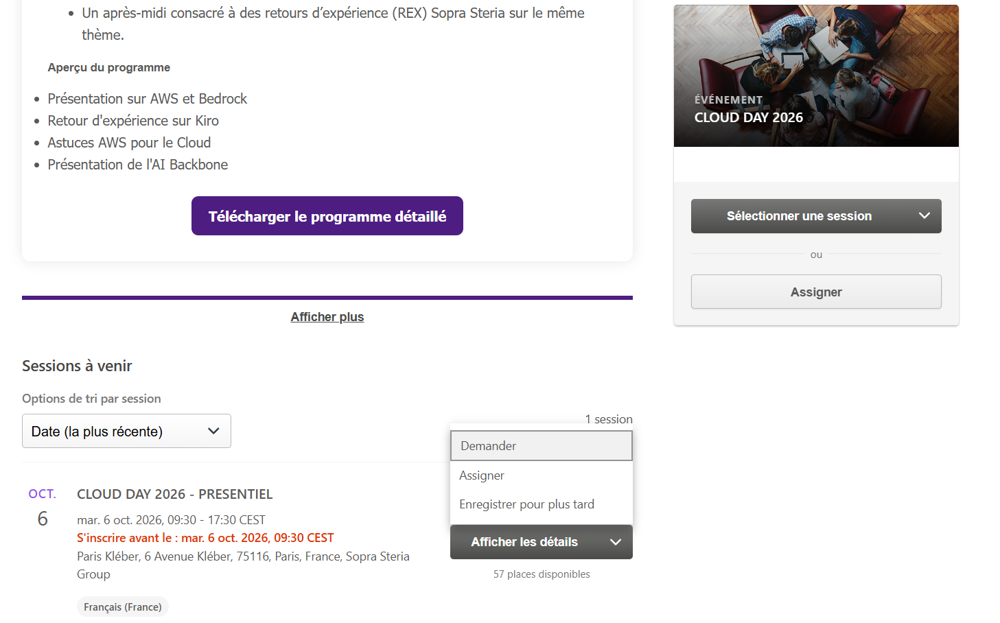

# Implementation Plan: NOAA-20 DigIF to SDR Pipeline

## Overview

Automated pipeline converting raw DigIF files (.pcap VITA-49) received via AWS Ground Station S3 Data Delivery into calibrated SDR + GEO (HDF5 Level 1) files. Architecture: S3 ObjectCreated → EventBridge → Step Functions (execution name = contact_id) → Map state with N × CodeBuild per chunk → Final CodeBuild aggregation. Single Docker image with all tools (Python extractor, SatDump v1.2.0, RT-STPS, CSPP SDR). Infrastructure deployed via Terraform in eu-central-1.

## Tasks

- [x] 1. Docker image and ECR repository
  - [x] 1.1 Create ECR repository Terraform module
    - Create `modules/sdr_pipeline/ecr.tf` with `aws_ecr_repository` resource
    - Add lifecycle policy (keep last 5 images)
    - Enable image scanning on push
    - Encryption with project KMS CMK
    - _Requirements: 7.3, 8.1_

  - [x] 1.2 Create Dockerfile for multi-tool image
    - Create `docker/sdr-pipeline/Dockerfile` based on `ubuntu:22.04`
    - Install system deps: python3.12, pip, openjdk-17-jre-headless, ocl-icd-libopencl1, wget, curl, unzip
    - Install Python deps: sgp4, pyorbital, boto3, numpy, hypothesis (dev)
    - Add placeholder COPY instructions for SatDump v1.2.0, RT-STPS 7.x, CSPP SDR archives
    - Set PATH, CSPP_HOME, RTSTPS_HOME environment variables
    - Copy pipeline scripts to `/opt/scripts/`
    - _Requirements: 2.6, 7.3_

  - [x] 1.3 Create Docker build script and CI integration
    - Create `docker/sdr-pipeline/build.sh` for local build + ECR push
    - Tag image with git SHA and `latest`
    - _Requirements: 7.3_

- [x] 2. I/Q Extractor Python script
  - [x] 2.1 Implement IQExtractor class
    - Create `scripts/iq_extract.py` with `IQExtractor` class
    - Implement pcap parsing using `struct` (no scapy dependency)
    - Parse layers: pcap record header (16B) → Ethernet (14B) → IP (20+B) → UDP (8B) → VITA-49 header
    - Extract I/Q payload (Complex 8-bit signed)
    - Implement `_parse_vita49_header()` for sequence number and sample rate extraction
    - Implement `_validate_sample_rate()`: accept if |rate - 34312500| <= 1
    - Implement `_detect_gaps()`: detect sequence number discontinuities
    - Insert zeros at gap positions (gap_length × samples_per_packet × 2 bytes)
    - Write .cs8 output file
    - Return `ExtractionResult` dataclass with metrics
    - Raise `NoValidPacketsError` if zero valid VITA-49 packets
    - Add CLI entry point (`__main__` block) accepting pcap_path and output_path args
    - _Requirements: 1.1, 1.2, 1.3, 1.4, 1.5, 1.6, 1.7_

  - [-] 2.2 Write property test: I/Q extraction round-trip integrity
    - **Property 1: I/Q extraction round-trip integrity**
    - Generate random valid pcap files with known I/Q payloads using Hypothesis strategies
    - Assert output .cs8 content equals concatenation of VITA-49 payloads in order
    - Assert output file size == sum(payload_sizes) + (gap_count × gap_size)
    - Assert no residual header bytes in output
    - **Validates: Requirements 1.1, 1.2**

  - [-] 2.3 Write property test: Sample rate validation boundary
    - **Property 2: Sample rate validation boundary**
    - Generate VITA-49 headers with sample rates in range [34312490, 34312510]
    - Assert accepted if |rate - 34312500| <= 1 (values 34312499, 34312500, 34312501)
    - Assert rejected/warned if outside (34312498, 34312502)
    - **Validates: Requirements 1.3**

  - [-] 2.4 Write property test: Gap detection and zero-fill
    - **Property 3: Gap detection and zero-fill**
    - Generate sequences of VITA-49 packets with random discontinuities
    - Assert zeros inserted == gap_length × samples_per_packet × 2 bytes at each gap
    - Assert gaps_detected count == number of discontinuities
    - **Validates: Requirements 1.4**

  - [-] 2.5 Write property test: File acceptance criterion
    - **Property 4: File acceptance criterion**
    - Generate .pcap files with 0..N valid VITA-49 packets (mixed with invalid packets)
    - Assert file accepted if at least 1 valid packet exists
    - Assert `NoValidPacketsError` raised if 0 valid packets
    - **Validates: Requirements 1.5, 1.6**

- [x] 3. Checkpoint - Ensure IQ Extractor tests pass
  - Ensure all tests pass, ask the user if questions arise.

- [x] 4. SatDump wrapper script
  - [x] 4.1 Implement SatDump wrapper shell script
    - Create `scripts/satdump_process.sh`
    - Execute `satdump npp_hrd baseband <input> <output_dir> --samplerate 34312500 --baseband_format cs8`
    - Capture stdout/stderr to `satdump.log`
    - Validate exit code (non-zero → error with full context)
    - Validate .cadu file exists and is non-empty
    - Validate `dataset.json` exists (warning if missing)
    - Print success message with file size
    - _Requirements: 2.1, 2.2, 2.3, 2.4, 2.5, 2.6_

  - [-] 4.2 Write unit tests for SatDump wrapper validation logic
    - Test error propagation on non-zero exit code
    - Test empty .cadu detection
    - Test missing dataset.json warning
    - _Requirements: 2.4, 2.5_

- [x] 5. RT-STPS wrapper
  - [x] 5.1 Implement RTSTPSProcessor class
    - Create `scripts/rtstps_process.py` with `RTSTPSProcessor` class
    - Implement `_invoke_rtstps()`: subprocess call to RT-STPS with stdout/stderr capture
    - Implement `_validate_output()`: scan for RDR .h5 files, verify VIIRS granule exists
    - Implement `_find_rdr_files()`: glob for HDF5 files matching RDR naming patterns
    - Raise `NoVIIRSDataError` if no VIIRS granule produced
    - Emit warnings for missing non-critical instruments (ATMS, CrIS)
    - Return `RTSTPSResult` dataclass
    - Add CLI entry point
    - _Requirements: 3.1, 3.2, 3.3, 3.4, 3.5_

  - [x] 5.2 Write unit tests for RT-STPS wrapper
    - Test VIIRS granule validation (present/absent)
    - Test missing instrument warnings
    - Test error propagation on RT-STPS failure
    - _Requirements: 3.3, 3.4, 3.5_

- [x] 6. CSPP SDR wrapper
  - [x] 6.1 Implement CSPPProcessor class
    - Create `scripts/cspp_process.py` with `CSPPProcessor` class
    - Implement `_invoke_cspp()`: call `viirs_sdr.sh` per granule
    - Implement `_process_granule()`: process single granule, return success/failure dict
    - Implement `_collect_outputs()`: scan for SDR + GEO files matching expected patterns
    - Handle partial failure: continue processing remaining granules on per-granule failure
    - Classify status: "success" (all pass), "partial" (some pass), "failure" (none pass)
    - Raise `TotalCSPPFailure` if zero SDR files produced
    - Return `CSPPResult` dataclass
    - Add CLI entry point
    - _Requirements: 4.1, 4.2, 4.3, 4.5, 4.6_

  - [x] 6.2 Write property test: CSPP partial failure resilience
    - **Property 5: CSPP partial failure resilience**
    - Generate sets of granule processing results (mix of success/failure)
    - Assert SDR output exists for all successful granules
    - Assert failed granules recorded with error details
    - Assert status = "success" if all pass, "partial" if some pass, "failure" if none pass
    - **Validates: Requirements 4.5, 4.6**

  - [x] 6.3 Write unit tests for CSPP output collection
    - Test SDR + GEO file pattern matching (I-band, M-band, DNB)
    - Test per-granule failure recording
    - _Requirements: 4.2, 4.3_

- [x] 7. Checkpoint - Ensure all wrapper tests pass
  - Ensure all tests pass, ask the user if questions arise.

- [x] 8. Geolocation calculator
  - [x] 8.1 Implement GeolocationCalculator class
    - Create `scripts/geolocation.py` with `GeolocationCalculator` class
    - Implement `_fetch_tle()`: HTTP GET to CelesTrak, fallback to configured TLE on failure
    - Implement `_propagate_orbit()`: sgp4 propagation for each timestamp from dataset.json
    - Implement `_compute_bounding_box()`: tight bbox around ground track points
    - Implement `_extend_swath()`: extend bbox by VIIRS ±56° cross-track angle
    - Implement `_check_tle_age()`: return (age_hours, is_degraded) with 7-day threshold
    - Write per-chunk `coordinates.json` output matching schema
    - Add CLI entry point accepting aggregation dir and output dir
    - _Requirements: 5.1, 5.2, 5.3, 5.4, 5.5_

  - [x] 8.2 Write property test: Ground track validity and bounding box containment
    - **Property 6: Ground track validity and bounding box containment**
    - Generate valid TLEs (epoch < 7 days) and timestamp ranges using Hypothesis
    - Assert all ground track points have lat in [-90, 90], lon in [-180, 180]
    - Assert bounding box contains all ground track points
    - Assert swath bbox extends nadir bbox by VIIRS cross-track angle
    - **Validates: Requirements 5.1, 5.2**

  - [x] 8.3 Write property test: TLE degradation classification
    - **Property 7: TLE degradation classification**
    - Generate TLE epoch ages from 0 to 30 days using Hypothesis
    - Assert degraded = true if and only if age > 7 days
    - Assert degraded = false for age <= 7 days
    - **Validates: Requirements 5.5**

  - [x] 8.4 Write unit tests for geolocation
    - Test CelesTrak fallback on HTTP timeout
    - Test TLE age warning emission
    - Test coordinates.json schema compliance
    - _Requirements: 5.3, 5.4, 5.5_

- [x] 9. Manifest generation and metrics publishing
  - [x] 9.1 Implement manifest generator
    - Create `scripts/generate_manifest.py`
    - Aggregate chunk results from S3 metadata
    - List all SDR + GEO files from successful chunks with bounding boxes
    - List all failed chunks with error reasons
    - Compute `successful_chunks + len(failed_chunks) == total_chunks`
    - Generate manifest.json matching the defined JSON schema
    - _Requirements: 6.7_

  - [x] 9.2 Implement CloudWatch metrics publisher
    - Create `scripts/publish_metrics.py`
    - Read manifest.json and publish: ContactProcessingDuration, ChunksProcessed (success/failed/timeout), SDRFilesProduced, step durations, GapsDetected, TLEAge
    - Use `SDRPipeline` namespace with appropriate dimensions
    - _Requirements: 6.5_

  - [x] 9.3 Write property test: Manifest completeness
    - **Property 10: Manifest completeness**
    - Generate sets of chunk results (mix of successes and failures) with Hypothesis
    - Assert manifest lists all SDR + GEO files from successful chunks
    - Assert manifest lists all failed chunks with error reasons
    - Assert successful_chunks + len(failed_chunks) == total_chunks
    - **Validates: Requirements 6.7**

- [x] 10. CodeBuild buildspecs
  - [x] 10.1 Create chunk processing buildspec
    - Create `buildspecs/chunk_processing.yml` (buildspec version 0.2)
    - pre_build: download chunk from S3, create output dirs
    - build: sequential execution of iq_extract.py → satdump_process.sh → rtstps_process.py → cspp_process.py
    - post_build: upload SDR + GEO + dataset.json to S3 with KMS encryption
    - Environment variables: INPUT_BUCKET, INPUT_KEY, OUTPUT_BUCKET, CONTACT_ID, CONTACT_DATE, CHUNK_ID, KMS_KEY_ID
    - _Requirements: 6.2, 7.1, 8.1_

  - [x] 10.2 Create final aggregation buildspec
    - Create `buildspecs/final_aggregation.yml` (buildspec version 0.2)
    - pre_build: download chunk metadata (dataset.json files)
    - build: run geolocation.py, generate_manifest.py, publish_metrics.py
    - post_build: upload coordinates + manifest to S3 with KMS, remove .processing marker
    - _Requirements: 5.1, 6.7, 6.5_

  - [x] 10.3 Create chunk metadata downloader script
    - Create `scripts/download_chunk_metadata.py`
    - List S3 objects under `contacts/{contact_id}/chunks/` prefix
    - Download `dataset.json` from each chunk directory
    - _Requirements: 5.1, 6.7_

- [x] 11. Step Functions state machine (Terraform)
  - [x] 11.1 Create Step Functions state machine Terraform resource
    - Create `modules/sdr_pipeline/step_functions.tf`
    - Define ASL with states: ListChunks → CheckProcessingMarker → WriteProcessingMarker → Map(ParallelProcessing) → CheckResults → FinalAggregation
    - Map state: concurrency 19, each item starts CodeBuild, waits, checks status
    - Per-chunk retry: 2 attempts with exponential backoff (30s, 60s)
    - Per-build timeout: 20 minutes
    - Final aggregation build timeout: 10 minutes
    - Global timeout: 90 minutes
    - Execution name from input (contact_id) for idempotence
    - On total failure: notify SNS
    - IAM role for Step Functions (CodeBuild:StartBuild, CodeBuild:BatchGetBuilds, S3, SNS)
    - CloudWatch logging enabled
    - _Requirements: 6.1, 6.2, 6.3, 6.4, 6.6, 7.1, 7.2, 7.5_

  - [x] 11.2 Write property test: Chunk failure isolation
    - **Property 8: Chunk failure isolation**
    - Generate sets of chunks (some succeed, some fail after 2 retries) using Hypothesis
    - Assert pipeline continues processing remaining chunks
    - Assert results produced for successful chunks only
    - Assert failed chunks marked as error
    - Assert successful output count == chunks that completed
    - **Validates: Requirements 6.4**

  - [x] 11.3 Write property test: Pipeline idempotence
    - **Property 9: Pipeline idempotence via execution name**
    - Generate contact_ids and submission counts (N >= 1) using Hypothesis
    - Assert only one Step Functions execution created per contact_id
    - Assert subsequent submissions rejected with ExecutionAlreadyExists
    - **Validates: Requirements 6.6**

- [x] 12. EventBridge rule (Terraform)
  - [x] 12.1 Create EventBridge rule and target
    - Create `modules/sdr_pipeline/eventbridge.tf`
    - Rule: source = aws.s3, detail-type = "Object Created", filter on bucket name + .pcap suffix
    - Target: Step Functions state machine ARN
    - Input transformer: extract contact_id from S3 key, pass bucket + key
    - Execution name = contact_id (for idempotence)
    - IAM role for EventBridge → Step Functions (states:StartExecution)
    - _Requirements: 6.1, 6.6_

- [x] 13. S3 output bucket, KMS, and IAM roles (Terraform)
  - [x] 13.1 Create S3 output bucket with security configuration
    - Create `modules/sdr_pipeline/s3.tf`
    - Bucket: `{project}-sdr-output-{account_id}` with versioning enabled
    - Server-side encryption with project KMS CMK (SSE-KMS)
    - Block all public access
    - Enforce SSL (bucket policy denying non-TLS requests)
    - Server access logging enabled
    - Lifecycle rule: transition to IA after 90 days, Glacier after 365 days
    - _Requirements: 8.1, 8.3, 8.4, 8.5_

  - [x] 13.2 Create IAM roles with least-privilege policies
    - Create `modules/sdr_pipeline/iam.tf`
    - CodeBuild role: read source bucket, write output bucket, KMS encrypt/decrypt, CloudWatch Logs write, CloudWatch metrics put, ECR pull
    - Step Functions role: CodeBuild StartBuild + BatchGetBuilds, S3 read/write for markers, SNS publish
    - EventBridge role: states:StartExecution on the state machine ARN only
    - All roles with explicit conditions (source account, resource ARNs)
    - _Requirements: 8.2, 8.6_

  - [x] 13.3 Create CodeBuild project resource
    - Create `modules/sdr_pipeline/codebuild.tf`
    - Project: BUILD_GENERAL1_LARGE compute type
    - Source: buildspec from S3 or inline
    - Environment: LINUX_CONTAINER, Docker image from ECR
    - Privileged mode disabled
    - CloudWatch Logs group with 90-day retention
    - VPC not required (internet access needed for CelesTrak TLE)
    - _Requirements: 7.3, 7.4_

  - [x] 13.4 Create module entry point and variables
    - Create `modules/sdr_pipeline/main.tf` (module composition)
    - Create `modules/sdr_pipeline/variables.tf` (input bucket name, KMS key ARN, SNS topic ARN, project name, account ID)
    - Create `modules/sdr_pipeline/outputs.tf` (state machine ARN, output bucket name, CodeBuild project name)
    - Wire module in root `main.tf`
    - _Requirements: 7.3_

- [x] 14. Checkpoint - Ensure Terraform validates and all tests pass
  - Ensure all tests pass, ask the user if questions arise.
  - Run `terraform validate` on the module
  - Run `checkov -d modules/sdr_pipeline/ --quiet` for security findings

- [x] 15. Integration testing
  - [x] 15.1 Create integration test with sample data
    - Create `tests/integration/test_pipeline_e2e.py`
    - Use a small .pcap sample file (1 MB) to test: IQ extraction → file exists check
    - Verify .cs8 output file is valid (non-empty, correct size)
    - Verify ExtractionResult metrics are sensible
    - _Requirements: 1.1, 1.7_

  - [x] 15.2 Write idempotence integration test
    - Test: submit same contact_id twice to Step Functions mock
    - Assert second submission raises ExecutionAlreadyExists
    - _Requirements: 6.6_

  - [x] 15.3 Write timeout handling integration test
    - Mock a long-running build exceeding 20 minutes
    - Assert chunk marked as timeout
    - Assert pipeline continues with remaining chunks
    - _Requirements: 7.5, 6.4_

- [x] 16. Security checkpoint (Checkov)
  - [x] 16.1 Run Checkov security scan and remediate findings
    - Run `checkov -d modules/sdr_pipeline/ --quiet --download-external-modules false`
    - Fix all HIGH and CRITICAL findings
    - Document any accepted LOW/MEDIUM findings with justification comments
    - Verify: no public S3 access, KMS encryption at rest, TLS enforced, least-privilege IAM, logging enabled
    - _Requirements: 8.1, 8.2, 8.3, 8.4, 8.5, 8.6_

- [x] 17. Final checkpoint - Ensure all tests pass
  - Ensure all tests pass, ask the user if questions arise.
  - Run full pytest suite including property tests
  - Run `terraform validate`
  - Run Checkov (no HIGH/CRITICAL findings)

## Notes

- Tasks marked with `*` are optional and can be skipped for faster MVP
- Each task references specific requirements for traceability
- Checkpoints ensure incremental validation
- Property tests validate universal correctness properties from the design (10 properties mapped to Hypothesis tests)
- Unit tests validate specific examples and edge cases
- The Docker image requires manual placement of SatDump, RT-STPS, and CSPP archives before build (licensed software not in git)
- All infrastructure is deployed in eu-central-1 via Terraform
- Python 3.12 is the implementation language for all scripts
- Property 8 and 9 test orchestration logic — may require mocking Step Functions / CodeBuild interactions

## Task Dependency Graph

```json
{
  "waves": [
    { "id": 0, "tasks": ["1.1", "1.2", "1.3"] },
    { "id": 1, "tasks": ["2.1", "4.1", "5.1", "6.1"] },
    { "id": 2, "tasks": ["2.2", "2.3", "2.4", "2.5", "4.2", "5.2", "6.2", "6.3"] },
    { "id": 3, "tasks": ["8.1", "9.1", "9.2"] },
    { "id": 4, "tasks": ["8.2", "8.3", "8.4", "9.3"] },
    { "id": 5, "tasks": ["10.1", "10.2", "10.3"] },
    { "id": 6, "tasks": ["13.1", "13.2", "13.3", "13.4"] },
    { "id": 7, "tasks": ["11.1", "12.1"] },
    { "id": 8, "tasks": ["11.2", "11.3"] },
    { "id": 9, "tasks": ["15.1", "15.2", "15.3"] },
    { "id": 10, "tasks": ["16.1"] }
  ]
}
```
