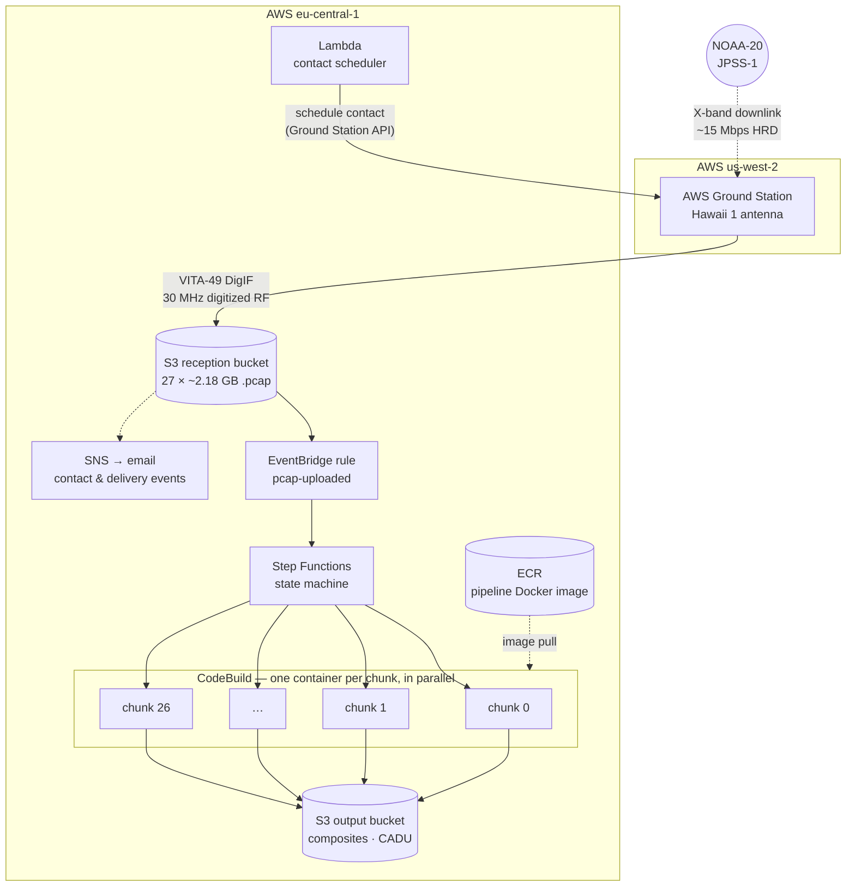
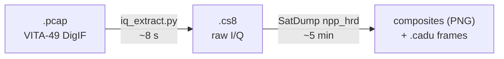

# Getting Labelled Earth Images from Space — Part 1: How Far Can Cloud and Open Source Take You?

What does it take to produce a labelled satellite image of the Earth — not by calling an imagery API, but by receiving the raw radio signal as the spacecraft passes overhead and processing it into pixels yourself?

This project set out to answer that question using only an AWS account and open-source software. This first article covers the cloud-plus-open-source approach: what it delivers, and where it reaches a hard limit. Part 2 examines the official NASA processing stack, Part 3 the pragmatic solution the project converged on, and Part 4 walks through the file formats stage by stage.

## Renting an antenna by the minute

The target satellite is NOAA-20 (JPSS-1), a polar-orbiting weather satellite carrying the VIIRS imager. It continuously broadcasts its instrument data on X-band; any suitably equipped ground station can receive it during the ten to fifteen minutes the satellite is above the horizon.

Instead of owning a 3-meter X-band dish, the project used AWS Ground Station, which provides antennas co-located with AWS regions on a pay-per-pass basis. A Lambda function calls the scheduling API and books a contact; the received signal is delivered directly to an S3 bucket.

The contact used throughout this series is contact #2: June 23, 2026, on the Hawaii 1 antenna, with the satellite visible from 18:20 to 18:43 UTC — a morning pass in local time (around 08:20), meaning the scene below is sunlit and true-color imagery is possible. Antenna time cost approximately $130.

```text
NOAA-20 pass over Hawaii — contact #2, 2026-06-23

18:20:55 UTC                                            18:43:32 UTC
     │◄──────────────────── visibility ────────────────────►│
     ▼                                                      ▼
S3:  [chunk_00][chunk_01][chunk_02][chunk_03] ... [chunk_26]
      ~30 s each · ~2.18 GB each · 27 files · 58.7 GB total
```

## What DigIF delivery actually means

At the HRD downlink rate of ~15 Mbps, a pass of this length corresponds to roughly 1.5–2 GB of demodulated data. What arrived in S3 was **58.7 GB**, split across 27 `.pcap` files of ~2.18 GB each.

The difference comes from the delivery mode. The mission profile was configured for *DigIF* delivery: instead of a demodulated bitstream, AWS delivers VITA-49 packets containing raw digitized RF — 30 MHz of spectrum, sampled at 34.3 Msps and written to disk. The files contain what the antenna received, signal and noise alike; demodulation is left to the customer.

For a learning project this is a useful property, because it forces the implementation of the entire signal chain.

## An event-driven pipeline, all open source

Processing 58.7 GB per pass by hand is not practical, so the pipeline is fully automated and deployed with Terraform. The architecture:



Each container runs two open-source steps:



1. **I/Q extraction** — a Python tool parses the VITA-49 packets, validates packet sequence numbers, reads the signal metadata from context packets, and writes raw I/Q samples (`.cs8`). About 8 seconds per 2 GB chunk.
2. **SatDump** — an open-source ground station suite. Its `npp_hrd` pipeline performs QPSK demodulation, Viterbi decoding and Reed-Solomon correction, producing clean CADU frames and, as a by-product, rendered image composites. About 5 minutes per chunk.

For contact #2, 27 containers ran in parallel. Roughly ten minutes after triggering, the output bucket contained VIIRS composites at native resolution — True Color, Thermal IR, Day Microphysics, and a dozen others — showing the Pacific in daylight along the satellite's track near Hawaii.

The capability is worth stating plainly: raw RF to satellite imagery, fully automated, on rented hardware, with no software licence costs.

## The limit: pixels are easy, coordinates are hard

The qualifier *labelled* is where this approach reaches its limit. An image becomes useful when geography is attached — coastlines, borders, place names — and that requires knowing the position of each pixel.

SatDump's composites are plain pixel grids with no per-pixel latitude/longitude. To draw a map overlay, the pipeline estimated the swath's geographic extent by propagating the satellite's orbit from public TLE data with SGP4. The measured results define the limit clearly:

- The overlay landed **100–300 km away** from the actual terrain; coastlines visibly did not align.
- The geometry is highly sensitive to timing: a 5-second error in the assumed pass time shifts the ground track by ~40 km.
- VIIRS scans in a curved "bowtie" pattern, so a linear geographic-to-pixel mapping is incorrect by construction.
- A TLE that had aged 2.5 years placed the swath thousands of kilometres off — orbit data has a short shelf life.

The summary of the cloud-plus-open-source approach: about $130 per pass and zero licence fees buys a working path from raw radio waves to imagery — but not an accurate answer to *where* each pixel is.

The standard answer to that problem is NASA's own processing software, which provides sub-kilometre per-pixel geolocation. Running it in the cloud turned out to be a substantial engineering problem of its own — that is Part 2.

*~760 words of prose. Note for publishing: the ASCII timeline renders anywhere; the two mermaid diagrams render on GitHub/GitLab natively — for Medium or dev.to, export them as images (e.g. via mermaid.live) before publishing.*
