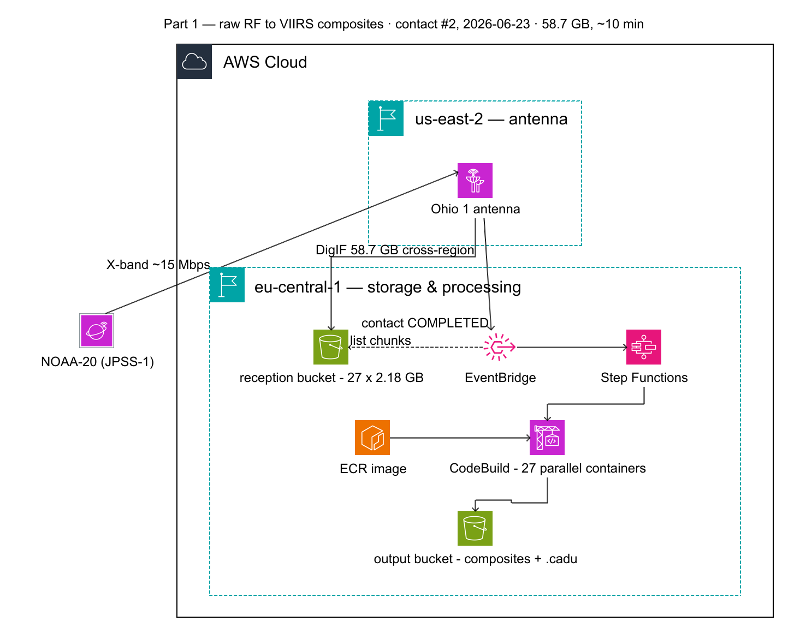

# Getting Labelled Earth Images from Space — Part 1: How Far Can Cloud and Open Source Take You?

What does it take to produce a labelled satellite image of the Earth — not by calling an imagery API, but by receiving the raw radio signal as the spacecraft passes overhead and turning it into pixels yourself?

This series answers that question with an AWS account and open-source software, and no owned hardware. Part 1 covers what the cloud-plus-open-source layer delivers, what it costs, and where it stops. Part 2 adds NASA's direct-broadcast stack and sub-kilometre geolocation. Part 3 covers the end-to-end result and the engineering lessons. Part 4 follows the file formats stage by stage.

## Renting an antenna by the minute

The target is NOAA-20 (JPSS-1), a polar-orbiting weather satellite carrying the VIIRS imager. It broadcasts instrument data continuously on X-band; any suitably equipped ground station can receive it during the ten to fifteen minutes it is above the horizon.

The alternative to owning a 3-metre X-band dish is AWS Ground Station: antennas co-located with AWS regions, booked per pass. That trade is the first business decision in the project, and it is not close for a demonstrator:

| | Own the dish | Rent by the minute |
|---|---|---|
| Up-front | Antenna, feed, site, mount — capex plus siting and licensing | $0 |
| Per pass | Amortised capex + maintenance | ~$130 |
| Time to first pass | Months | A Lambda call to the scheduling API |
| Coverage | One location | Any AWS Ground Station site |

A Lambda function books the contact and the received signal lands in S3. The pass used throughout this series is **contact #2: 2026-06-23, 18:20:55–18:43:32 UTC, on the Ohio 1 antenna (`us-east-2`)** — 13 minutes of visibility, delivered as **27 `.pcap` files of ~2.18 GB each, 58.7 GB in total**.

That timing is not arbitrary. NOAA-20 flies a sun-synchronous orbit with a ~13:25 local equator-crossing time on its daytime node, so the scene below is always mid-afternoon local solar time and always sunlit. Contact #2 crossed eastern North America and the Caribbean — Hudson Bay to Cuba — in full daylight, which is what makes true-colour imagery possible at all.

## What DigIF delivery actually costs

At the HRD downlink rate of ~15 Mbps, 13 minutes of pass is roughly 1.5–2 GB of demodulated data. 58.7 GB arrived instead — about 30× more.

The difference is the delivery mode. The mission profile requests **DigIF**: rather than a demodulated bitstream, AWS delivers VITA-49 packets containing 30 MHz of raw digitized spectrum sampled at 34.3 Msps — everything the antenna heard, signal and noise alike. Demodulation becomes the customer's problem.

For a project whose point is to implement the whole signal chain, that is the right choice. As an architectural decision it should be made deliberately, because it sets three costs at once: 30× the storage, 30× the transfer, and the obligation to build and run a demodulator. AWS also offers demodulated delivery; if the goal is imagery rather than education, that is the cheaper path.

Two costs the architecture diagram makes visible and that are easy to miss on the invoice: the antenna is in `us-east-2` while the bucket is in `eu-central-1`, so every pass crosses regions — at standard inter-region rates, on the order of $1 per pass, small but linear in pass count. And the 58.7 GB sits in S3 afterwards at roughly $1.35 per month for as long as it is retained.

## Ten minutes from radio to imagery

Processing 58.7 GB by hand is impractical, so the pipeline is fully automated and deployed with Terraform: the contact reaching `COMPLETED` fires an EventBridge rule, Step Functions lists the pass's chunks and fans out, and one CodeBuild container per chunk runs two open-source steps in parallel.

1. **I/Q extraction** — Python parses the VITA-49 packets, validates sequence numbers, reads signal metadata from context packets, and writes raw I/Q (`.cs8`). ~8 seconds per 2 GB chunk.
2. **SatDump** — an open-source ground station suite. Its `npp_hrd` pipeline does QPSK demodulation, Viterbi decoding and Reed-Solomon correction, emitting clean CADU frames plus rendered composites. ~5 minutes per chunk.

For contact #2, 27 containers ran at once. Roughly **ten minutes after the trigger**, the output bucket held VIIRS composites at native resolution — True Color, Thermal IR, Day Microphysics and a dozen others.

That is the capability, stated plainly: raw RF to satellite imagery, automated, on rented hardware, with no software licence cost. The honest per-pass total is closer to **$160 than $130**, because 27 parallel `general1.2xlarge` containers are roughly 140 build-minutes — the compute is a quarter of the bill again, and it is DigIF that put it there.

## The limit that wasn't the tool's

*Labelled* is where this first attempt stopped. An image becomes useful when geography is attached, and that requires knowing where each pixel is.

SatDump renders composites as plain pixel grids, so the pipeline attached coordinates afterwards: estimate the swath's extent by propagating the orbit from public TLE data with SGP4, then stretch the image across that box. Overlays landed **100–300 km from the actual terrain**, and coastlines visibly did not align. The approach is fragile by construction — a 5-second error in assumed pass time moves the ground track ~40 km, and VIIRS's curved "bowtie" scan means no linear pixel-to-ground mapping can be right.

The conclusion drawn at the time was that open source gets you pixels but not coordinates. That conclusion was wrong, and the way it was wrong is the more useful lesson.

SatDump ships the VIIRS scan model itself — the ±56° scan, the detector aggregation zones, the spacecraft pointing corrections — and stores a timestamp for every scan inside its own output. Ask it, and it will raytrace each scan line to the ellipsoid and write a georeferenced GeoTIFF. Nobody asked it. The 100–300 km was a property of the integration, not of the tool: a bounding box where a scan model was already available, three files away, in a repository that was already open in the browser.

Rebuilt on the geometry rather than the bounding box, the same free software puts coastlines on the imagery — measured at 90% agreement between what the pixels show and what is actually at each computed position, with no detectable systematic offset.

So the honest statement of the limit is narrower: about $160 per pass and zero licence fees buys a working path from radio waves to *located* imagery. What it does not buy is **calibration** — composites are display images, not physical measurements — nor the terrain-corrected, per-pixel geolocation that science products carry.

That is what NASA's own processing software adds, and that is Part 2.

---

*Figures: the architecture diagram is generated with [awslabs/diagram-as-code](https://github.com/awslabs/diagram-as-code) from [`diagrams/article-1-pipeline.yaml`](diagrams/article-1-pipeline.yaml). Cost figures are on-demand list prices for the region and dates given, and are estimates rather than invoice lines.*
