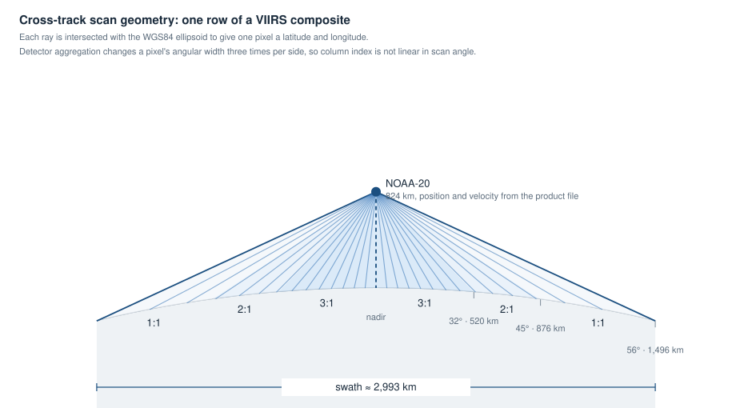

# Getting Labelled Earth Images from Space — Part 1: How Far Can Cloud and Open Source Take You?

What does it take to produce a labelled satellite image of the Earth — not by calling an imagery API, but by receiving the raw radio signal as the spacecraft passes overhead and turning it into pixels yourself?

This series answers that question with an AWS account and open-source software, and no owned hardware. Part 1 covers what the cloud-plus-open-source layer delivers, what it costs, and where the science limits begin. Part 2 adds NASA's direct-broadcast stack, calibrated radiances and terrain-corrected geolocation. Part 3 covers the end-to-end result and the engineering lessons. Part 4 follows the file formats stage by stage.

## Renting an antenna by the minute

The target is NOAA-20 (JPSS-1), a polar-orbiting weather satellite carrying the VIIRS imager. It broadcasts instrument data continuously on X-band; any suitably equipped ground station can receive it during the ten to fifteen minutes it is above the horizon.

The alternative to owning a 3-metre X-band dish is AWS Ground Station: antennas co-located with AWS regions, booked per pass. That trade is the first business decision in the project, and it is not close for a demonstrator:

| | Own the dish | Rent by the minute |
|---|---|---|
| Up-front | Antenna, feed, site, mount — capex plus siting and licensing | $0 |
| Per pass | Amortised capex + maintenance | ~$130 |
| Time to first pass | Months | A Lambda call to the scheduling API |
| Coverage | One location | Any AWS Ground Station site |

A Lambda function books the contact and the received signal lands in S3. The pass used throughout this series is **contact #2: 2026-06-23, 18:20:55–18:43:32 UTC, on the Ohio 1 antenna (`us-east-2`)** — 13 minutes of visibility, delivered as **27 `.pcap` files of ~2.18 GB each, 58.7 GB in total**.

That timing is not arbitrary. NOAA-20 flies a sun-synchronous orbit with a ~13:25 local equator-crossing time on its daytime node, so the scene below is always mid-afternoon local solar time and always sunlit. Contact #2 crossed eastern North America and the Caribbean — Hudson Bay to Cuba — in full daylight, which is what makes true-colour imagery possible at all.

## What DigIF delivery actually costs

At the HRD downlink rate of ~15 Mbps, 13 minutes of pass is roughly 1.5–2 GB of demodulated data. 58.7 GB arrived instead — about 30× more.

The difference is the delivery mode. The mission profile requests **DigIF**: rather than a demodulated bitstream, AWS delivers VITA-49 packets containing 30 MHz of raw digitized spectrum sampled at 34.3 Msps — everything the antenna heard, signal and noise alike. Demodulation becomes the customer's problem.

For a project whose point is to implement the whole signal chain, that is the right choice. As an architectural decision it should be made deliberately, because it sets three costs at once: 30× the storage, 30× the transfer, and the obligation to build and run a demodulator. AWS also offers demodulated delivery; if the goal is imagery rather than education, that is the cheaper path.

Two costs the architecture diagram makes visible and that are easy to miss on the invoice: the antenna is in `us-east-2` while the bucket is in `eu-central-1`, so every pass crosses regions — at standard inter-region rates, on the order of $1 per pass, small but linear in pass count. And the 58.7 GB sits in S3 afterwards at roughly $1.35 per month for as long as it is retained.

## Ten minutes from radio to imagery

Processing 58.7 GB by hand is impractical, so the pipeline is fully automated and deployed with Terraform: the contact reaching `COMPLETED` fires an EventBridge rule, Step Functions lists the pass's chunks and fans out, and one CodeBuild container per chunk runs two open-source steps.

1. **I/Q extraction** — Python parses the VITA-49 packets, validates sequence numbers, reads signal metadata from context packets, and writes raw I/Q (`.cs8`). ~8 seconds per 2 GB chunk.
2. **SatDump** — an open-source ground station suite. Its `npp_hrd` pipeline does QPSK demodulation, Viterbi decoding and Reed-Solomon correction, emitting clean CADU frames plus rendered composites. ~5 minutes per chunk.

For contact #2, 27 containers ran at once. Roughly **ten minutes after the trigger**, the output bucket held VIIRS composites at native resolution — True Color, Thermal IR, Day Microphysics and a dozen others.

The honest per-pass total is closer to **$160 than $130**, because 27 parallel `general1.2xlarge` containers are roughly 140 build-minutes — the compute is a quarter of the bill again, and it is DigIF that put it there.

## Placing the pixels on the map

A composite is a pixel grid; an image becomes useful when geography is attached. SatDump publishes what is needed to do that properly, so the pipeline computes coordinates rather than estimating an extent.

Two inputs come from SatDump itself: the **scan model** in its projection settings for JPSS-1 — a 112° cross-track sweep, the detector aggregation zones, the spacecraft roll and yaw offsets — and the **satellite state** in the product file beside the imagery, with position, velocity and a timestamp for every scan.

Geolocation is then a raytrace. For each image row, interpolate the satellite state at that row's acquisition time, sweep the scan angle across its columns, and intersect each look ray with the WGS84 ellipsoid. That gives a latitude and longitude per pixel. The composite is resampled onto a north-up grid whose extent *is* its bounding box, so the map overlay, the GeoTIFF corners and the JSON sidecar are correct without any of them knowing about swath geometry.

The figure is one row of the composite, seen end-on. Equal steps in scan angle land ever further apart on the ground as the ray leans away from nadir — which is why the swath is ~3,000 km wide for a sensor 824 km up, and why the outer third of it is the hardest to place. The shaded bands are the detector aggregation zones: VIIRS combines three samples per pixel near nadir, two further out and one at the edge, so a pixel's angular width changes twice per side. Treat column index as linear in scan angle and the error is zero at nadir and grows all the way out.

Measured rather than asserted: classify each swath pixel as land or sea by colour, look up what is actually at its computed position in a rasterised Natural Earth mask, and correlate. **90% agreement, no detectable systematic offset.** Each composite ships as a PNG with overlays, a GeoTIFF, and a sidecar carrying the bounding box and acquisition time.

### Points of attention

Four of these five fail silently, which is what makes them worth listing:

- **SatDump needs a TLE, and its updater may not reach CelesTrak.** From CodeBuild the fetch fails with `0 TLEs loaded!`. Composites decode fine without one, so nothing looks wrong until geolocation resolves every control point to the same place. Pass `--tle_override` and bundle a fallback TLE in the image.
- **Timestamps are per scan, not per line** — 16 values for a 256-row image. Expand them at the line rate the configuration states, rather than spreading rows across the ephemeris window.
- **Columns are not linear in scan angle.** VIIRS aggregates detectors 3:1 near nadir, then 2:1, then 1:1, with the zone boundaries published alongside. A linear mapping matches the coastlines near nadir and not at all at the swath edge.
- **Two storage conventions are not derivable from geometry**: which end of the scan is column 0, and whether row 0 is the first or last line acquired. Settle them by scoring against known coastlines — a swath flipped end to end still looks plausible by eye.
- **SatDump can project composites itself** via a `project` block, which is the better path when it works, since it owns the model and applies the pointing corrections. At 1.2.2 that path receives per-scan timestamps for a per-line image, resolves zero ground control points and crashes; re-test it on one chunk at the next upgrade.

## What this layer does not give you

About $160 per pass and zero licence fees buys raw RF to *located* imagery in ten minutes, automated on rented hardware.

What it does not buy is **calibration** — these composites are display images, stretched for contrast, not physical measurements — nor **terrain-corrected coordinates for every pixel**, since the raytrace above models the nominal scan geometry and an ellipsoid, not the ground beneath it.

Both are what NASA's own direct-broadcast software adds. That is Part 2.

## Glossary

| Term | Meaning |
|---|---|
| **VIIRS** | Visible Infrared Imaging Radiometer Suite — the imager aboard NOAA-20, scanning a ~3,000 km swath across the ground track |
| **HRD** | High Rate Data, the ~15 Mbps X-band broadcast carrying VIIRS and the other instruments |
| **DigIF** | Digital Intermediate Frequency: AWS delivers raw digitized spectrum rather than a demodulated bitstream |
| **VITA-49** | The packet format that DigIF spectrum arrives in, with signal metadata in separate context packets |
| **I/Q** | In-phase and quadrature samples — the complex representation of a radio signal. Written here as `.cs8`, 8-bit signed pairs |
| **QPSK** | Quadrature Phase Shift Keying, the downlink's modulation; demodulation recovers bits from I/Q |
| **Viterbi / Reed-Solomon** | The two error-correction stages: convolutional decoding, then block correction of the remaining byte errors |
| **CADU** | Channel Access Data Unit — a fixed-length CCSDS frame, the first clean digital product of the chain |
| **Composite** | An image built from several instrument bands (True Color = three reflective bands), stretched for display |
| **Sun-synchronous orbit** | An orbit whose plane precesses with the Sun, so the spacecraft crosses each latitude at the same local solar time every pass |
| **Nadir** | The point directly beneath the spacecraft; scan angle is measured from it |
| **Swath** | The strip of ground one scan covers, here ±56° either side of nadir |
| **Detector aggregation** | VIIRS combines several samples into one pixel near nadir (3:1), fewer further out (2:1, then 1:1), to keep ground resolution roughly even |
| **Ephemeris** | Satellite position and velocity over time — here recorded per scan in SatDump's product file |
| **TLE** | Two-Line Element set, a compact orbit description propagated with SGP4 to get position at a given time |
| **WGS84** | The reference ellipsoid coordinates are expressed against; the look ray is intersected with it |
| **Equirectangular** | A projection mapping latitude and longitude directly to y and x — the north-up grid composites are resampled onto |
| **GeoTIFF** | A TIFF carrying its own georeferencing, so other tools can place it without external metadata |

---

*Figures: the architecture diagram is generated with [awslabs/diagram-as-code](https://github.com/awslabs/diagram-as-code) from [`diagrams/article-1-pipeline.yaml`](diagrams/article-1-pipeline.yaml); the scan-geometry figure is generated by [`diagrams/article-1-geolocation.py`](diagrams/article-1-geolocation.py), whose angles and ground distances are computed rather than sketched — only the curvature is exaggerated for legibility. Cost figures are on-demand list prices for the region and dates given, and are estimates rather than invoice lines.*
