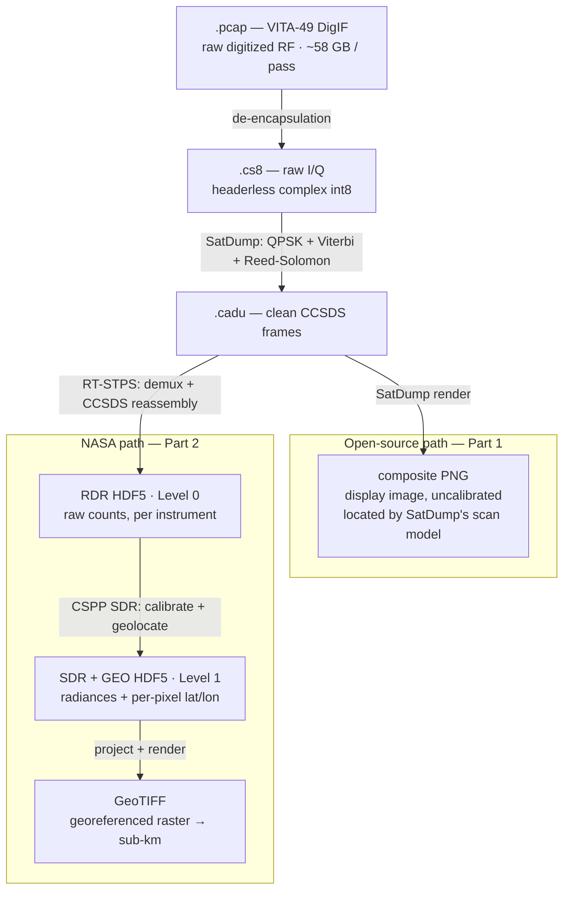
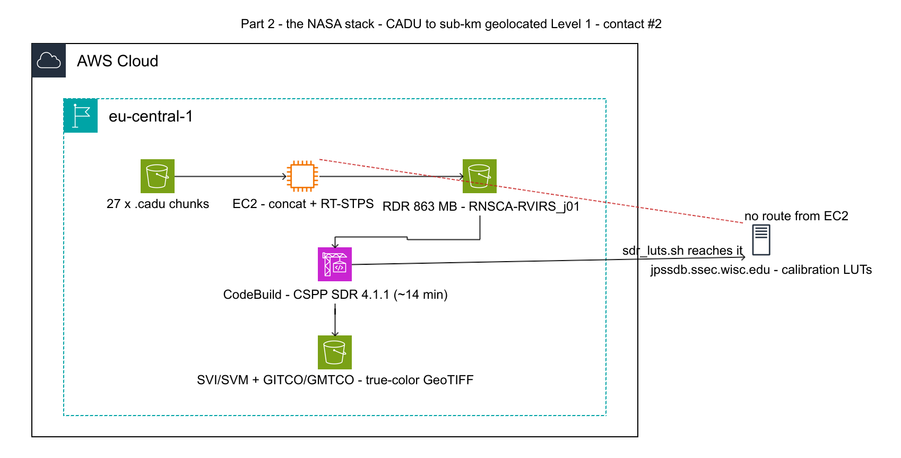

# Getting Labelled Earth Images from Space — Part 2: What the NASA Stack Adds

[Part 1](./article-1-cloud-opensource.md) built a cloud pipeline that turns raw NOAA-20 radio signals into located VIIRS imagery for about $160 a pass, geolocated by raytracing the published scan model against the satellite state SatDump records.

What that layer does not give you is **calibration** — its composites are display images, not physical measurements — or **terrain-corrected coordinates for every pixel**. That is what the agencies' own software adds, and it is a different kind of claim: not "roughly here" made precise, but radiances you can do science on, each carrying its own latitude and longitude, corrected for the ground beneath. The result, from the same 13-minute pass:

Hudson Bay, the Great Lakes, Florida, Cuba and the Bahamas, each sitting on its own coastline. Same antenna, same $130 of downlink, same zero licence fees — and every pixel carrying its own terrain-corrected coordinate, accurate to **sub-kilometre**, rather than a scan model's estimate of where the swath fell.

## Two chains, two file trails

Both pipelines share a front end: the clean CADU frames that [Part 1](./article-1-cloud-opensource.md)'s SatDump step produces. From there they diverge, and the divergence is entirely about what each file format carries.

[SatDump](./article-1-cloud-opensource.md) renders CADUs straight to composite PNGs — display images, located by raytracing the nominal scan geometry. That is enough to put a coastline in the right place; it is not a measurement. The NASA chain instead keeps the science all the way down: RDRs hold raw counts, SDRs hold calibrated physical radiances, and GEO files hold terrain-corrected latitude and longitude for *every pixel* — accounting for the terrain the scan model assumes away.

## What the official chain produces

Two free packages do the work:

- **RT-STPS** (NASA) ingests CADU frames and produces Level 0 **RDR** files — raw instrument science data in HDF5.
- **CSPP SDR** (University of Wisconsin/CIMSS) turns RDRs into Level 1 **SDR** products: calibrated radiances and brightness temperatures, plus **GEO** files carrying terrain-corrected latitude and longitude for *every pixel*.

That last item is the whole point. Part 1 estimated where the swath probably was; CSPP states where each pixel actually is, corrected for terrain. Calibration matters just as much: [SatDump](./article-1-cloud-opensource.md)'s composites are display images, while SDR radiances are physical quantities you can do science on.

## What running them on ephemeral cloud requires

Both packages were written for a long-lived Linux workstation. Running them on ephemeral AWS infrastructure sets five requirements; each has a concrete solution, and with all five met the chain runs deterministically.

**A full granule of contiguous data.** A VIIRS granule needs ~85 seconds of continuous downlink, while the Part 1 pipeline works in 30-second chunks. *Solution:* every container uploads its CADUs to S3, and a separate step concatenates all 27 chunks into one stream, processed once. For contact #2 that produced an **863 MB VIIRS RDR** (plus CrIS, ATMS and two OMPS instruments).

**The NOAA-20 spacecraft configuration.** RT-STPS ships one XML per satellite. *Solution:* select `jpss1.xml` for NOAA-20 (`npp.xml` is Suomi-NPP).

**Frames descrambled exactly once.** Downlinks are scrambled with a pseudo-noise sequence, and SatDump already removes it during demodulation. *Solution:* tell RT-STPS the frames are already clean — `PnEncoded="false"` with the `pn` node dropped — so it does not XOR clean frames back into noise.

**The spacecraft token preserved in the RDR filename.** `viirs_sdr.sh` reads the spacecraft from the `_j01_` token *in the filename*. *Solution:* keep the `RNSCA-RVIRS_j01_….h5` name that RT-STPS emits; the token has to survive to the SDR step intact.

**A network path to the calibration LUT server.** This requirement is about where you run, not how. CSPP populates a calibration lookup-table cache by fetching from `jpssdb.ssec.wisc.edu` at setup time. CodeBuild reaches that host; the EC2 aggregation instance in this account does not. *Solution:* run the CSPP step in CodeBuild — chosen for egress, not compute — where it takes about 14 minutes.

That last requirement is the durable lesson, and it survives the fact that the chain works: software written for a persistent workstation expects state and network access that ephemeral, locked-down cloud compute does not grant by default. Deciding which execution environment holds the network path is an architecture question, not a bug to fix.

## What it's worth

The value is easy to state, and worth stating carefully. Against a bounding-box stretch, this is a two-to-three order of magnitude improvement in geolocation. Against the open-source path done properly, the gain is narrower and different in kind: sub-kilometre terrain-corrected coordinates per pixel instead of a scan-model estimate, and calibrated radiances instead of display images. The first is what makes overlays trustworthy at full resolution; the second is what makes the data science rather than pictures. The cost was entirely engineering time; the compute is ~14 CodeBuild minutes on top of a $160 pass.

## What makes a contact worth processing

The software can only calibrate what the antenna cleanly heard, so a pass's value is decided before any of this code runs. Three conditions separate a contact that yields a full true-colour mosaic from one that yields a single thermal granule:

- **Daylight over the target.** VIIRS's reflective bands — the ones true colour is built from — need sunlight. Contact #2 was a daytime pass and produced **10 fully calibrated granules**; a night pass has no reflective bands at all and gives thermal only. NOAA-20's sun-synchronous orbit crosses its daytime node near 13:25 local solar time, so booking that node is what makes true colour possible in the first place.
- **High elevation and clean RF.** Calibration is all-or-nothing per granule: a partial granule from RF packet loss cannot be calibrated and is dropped. A high-max-elevation pass keeps the spacecraft above the horizon longer on a stronger link, so more complete granules survive. Contact #3, at night and from a comparable raw RDR, yielded just one usable thermal granule.
- **A long enough pass to fill granules.** Granules are ~85 seconds each, so short or low passes produce fewer complete ones. The mosaic you can build is capped by how many contiguous granules the pass delivered — by what the antenna heard, not by what the software can do.

## Glossary

Terms introduced in this part. [Part 1's glossary](./article-1-cloud-opensource.md#glossary) covers the reception and demodulation vocabulary — DigIF, CADU, swath, nadir, ephemeris and the rest — which is not repeated here.

### Software packages

| Term | Meaning |
|---|---|
| **RT-STPS** | Real-Time Software Telemetry Processing System (NASA): demultiplexes CADU frames per instrument and reassembles CCSDS packets into Level 0 files |
| **CSPP** | Community Satellite Processing Package (University of Wisconsin/CIMSS): turns Level 0 into calibrated, geolocated Level 1 products |

### Processing levels and product names

| Term | Meaning |
|---|---|
| **Level 0 / Level 1** | Processing levels. Level 0 is raw instrument counts as downlinked; Level 1 is those counts converted to physical units and tied to positions on the ground |
| **RDR** | Raw Data Record — the JPSS name for the Level 0 product RT-STPS writes |
| **SDR** | Sensor Data Record — the JPSS Level 1 product: calibrated radiances and brightness temperatures. Note the collision with "software-defined radio", which this is not |
| **GEO file** | The geolocation companion to an SDR, holding latitude and longitude for every pixel. `GITCO` for the imaging bands, `GMTCO` for the moderate ones |
| **Granule** | The unit CSPP calibrates, ~85 seconds of continuous VIIRS data. Calibration is all-or-nothing per granule: an incomplete one is dropped rather than partially processed |
| **HDF5** | The self-describing container format RDR, SDR and GEO products use, holding multi-dimensional arrays with their metadata |

### Physical vocabulary

| Term | Meaning |
|---|---|
| **Radiance** | The physical quantity the instrument measures — energy per area, solid angle and wavelength — as opposed to a display value stretched for contrast |
| **Brightness temperature** | An infrared radiance expressed as the temperature a perfect emitter would need to produce it. Convenient because it reads directly as degrees |
| **Terrain correction** | Adjusting a pixel's coordinates for the elevation of the ground it fell on. A ray traced to a smooth ellipsoid misplaces a mountainside; the "TC" in `GITCO`/`GMTCO` |

### Mission and instruments

| Term | Meaning |
|---|---|
| **Direct broadcast** | The satellite transmitting continuously to whoever is listening, rather than storing data for a scheduled dump to an agency ground station. It is what makes a private receiver possible at all |
| **CrIS / ATMS / OMPS** | The other JPSS instruments carried in the same downlink — an infrared sounder, a microwave sounder, and an ozone mapper. RT-STPS separates them from VIIRS |

### Downlink and calibration plumbing

| Term | Meaning |
|---|---|
| **CCSDS** | The space-agency packet standards the downlink follows; RT-STPS reassembles these packets from the frame stream |
| **Pseudo-noise (PN) scrambling** | A known bit pattern XORed onto the downlink to keep the signal spectrally well-behaved. Removing it twice is the same as not removing it — hence `PnEncoded="false"` once SatDump has already done it |
| **Calibration LUT** | Lookup tables converting raw counts to radiances, updated as the instrument ages. CSPP fetches them from `jpssdb.ssec.wisc.edu`, which is why that step needs network egress |

---

*Figures: architecture diagram generated with [awslabs/diagram-as-code](https://github.com/awslabs/diagram-as-code) from [`diagrams/article-2-nasa-stack.yaml`](diagrams/article-2-nasa-stack.yaml); the file-transformation diagram renders natively on GitHub/GitLab — export it as an image (e.g. via mermaid.live) before publishing to Medium or dev.to. The full CSPP recipe is in [`docs/DEPLOYMENT.md`](../docs/DEPLOYMENT.md).*
