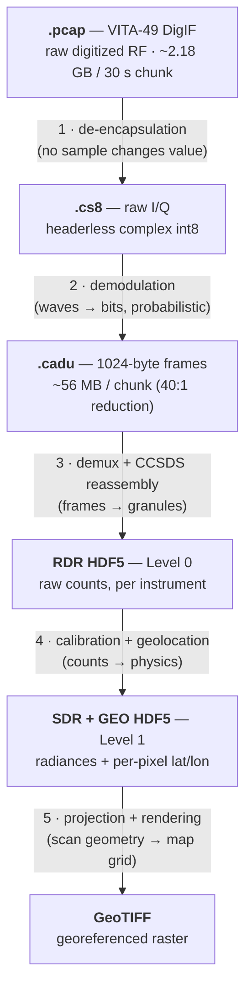
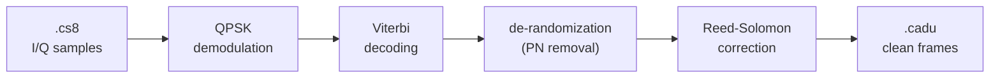

# Getting Labelled Earth Images from Space — Part 4: Follow the Bytes, One File Format at a Time

The previous articles told the story of a cloud ground station chronologically. This one retells it structurally: what the data looks like at each stage, and the transformation principle that carries it from one format to the next. The pipeline applies one idea repeatedly — **strip a container, add meaning** — and the data shrinks at almost every step, from tens of gigabytes to a few megabytes, while the information per byte grows.



## 1. `.pcap` — VITA-49 DigIF: the signal, wrapped for transport

AWS Ground Station delivers each 30-second slice of a pass as a ~2.18 GB `.pcap` file. Inside the pcap framing are **VITA-49** packets, the standard format for transporting digitized radio. Two packet types matter:

- **Data packets** carry the payload: raw I/Q samples of the received spectrum.
- **Context packets** carry the signal parameters as fixed-point fields: sample rate (34,312,500 Hz), bandwidth (~30 MHz), RF center frequency (NOAA-20's X-band downlink), gain — encoded as 64-bit radix-20 fixed-point numbers.

```text
VITA-49 data packet                    VITA-49 context packet
┌──────────────────────────┐          ┌──────────────────────────┐
│ 32-bit header            │          │ 32-bit header            │
│  type=1 · seq · size     │          │  type=4 · seq · size     │
├──────────────────────────┤          ├──────────────────────────┤
│ stream ID / timestamps   │          │ stream ID / timestamps   │
├──────────────────────────┤          ├──────────────────────────┤
│                          │          │ context indicator field  │
│   I/Q sample payload     │          │  bandwidth      (fixed-pt│
│   (the actual signal)    │          │  RF frequency    radix 20│
│                          │          │  sample rate     64-bit) │
└──────────────────────────┘          └──────────────────────────┘
        the payload                     the signal parameters
```

At this stage the file contains everything the antenna received — signal, noise, and neighboring spectrum alike.

**Transformation principle → next format: de-encapsulation.** Parse headers, validate packet sequence numbers (to detect drops), read the metadata, discard the wrapping, concatenate the payloads. No signal processing occurs; no sample changes value.

## 2. `.cs8` — raw I/Q samples

The result is a `.cs8` file: interleaved **complex signed 8-bit** samples, with no header.

```text
byte:    0     1     2     3     4     5     6     7   ...
      ┌─────┬─────┬─────┬─────┬─────┬─────┬─────┬─────┐
      │ I₀  │ Q₀  │ I₁  │ Q₁  │ I₂  │ Q₂  │ I₃  │ Q₃  │   each an int8
      └─────┴─────┴─────┴─────┴─────┴─────┴─────┴─────┘
      └── sample 0 ┘└── sample 1 ┘└── sample 2 ┘
                34,312,500 complex samples per second
```

This is the simplest format in the chain: a `.cs8` file is uninterpretable without the sample rate, which is carried separately from the context packets. The content is the digitized signal itself.

**Transformation principle → next format: demodulation — from waves to bits.** This is the only step that crosses the analog/digital divide, and the only probabilistic one:



QPSK demodulation maps phase states to symbol estimates, Viterbi decoding performs maximum-likelihood recovery from the convolutional code, derandomization removes the pseudo-noise scrambling, and Reed-Solomon corrects residual bit errors. Every step downstream of this one is deterministic.

## 3. `.cadu` — CCSDS transfer frames

Out comes a stream of **CADUs** (Channel Access Data Units): fixed 1024-byte frames.

```text
byte 0        4         10                              896         1024
┌─────────────┬──────────┬───────────────────────────────┬────────────┐
│ ASM         │ VCDU hdr │  data zone                    │ Reed-      │
│ 1A CF FC 1D │ SCID 159 │  (CCSDS packets, possibly     │ Solomon    │
│ (sync)      │ VCID 16  │   spanning frame boundaries)  │ parity     │
└─────────────┴──────────┴───────────────────────────────┴────────────┘
     sync      identification      payload                error check
```

Each frame opens with the sync marker `1A CF FC 1D`, followed by a header identifying spacecraft 159 (JPSS-1) and a virtual channel (VCID 16 = VIIRS), then payload and Reed-Solomon parity. One 2 GB RF chunk reduces to ~56 MB of CADUs — a 40:1 reduction, since the noise and empty spectrum are gone:

```text
.pcap     ██████████████████████████████████████████████████  40.9 GB   (whole contact, 19 chunks)
.cs8      ███████████████████████████████████████████        ~38 GB    (transport stripped)
.cadu     █▍                                                  ~1.3 GB   (noise & empty spectrum gone)
RDR HDF5  ▋                                                   ~580 MB   (VIIRS + CrIS + ATMS + OMPS)
GeoTIFF   ▏                                                   a few MB  (the image)
```

**Transformation principle → next format: demultiplexing and reassembly.** CADUs are a transport layer multiplexing several instruments onto one radio link. RT-STPS sorts frames by virtual channel, reassembles the CCSDS application packets that span frame boundaries, and groups them by time into *granules*. This step has a physical constraint: a VIIRS granule spans ~85 seconds, so 30-second chunks must be concatenated before processing — a format detail that reshaped the pipeline architecture.

## 4. RDR HDF5 — Level 0: science data, still in engineering units

The output is **RDR** (Raw Data Record) files in HDF5 — one per instrument:

```text
/opt/data/ after RT-STPS (one pass):
├── RVIRS_j01_…​.h5    344 MB   VIIRS   (the imager)
├── RCRIS_j01_…​.h5    226 MB   CrIS    (infrared sounder)
├── RATMS_j01_…​.h5    3.5 MB   ATMS    (microwave sounder)
├── ROLPS_j01_…​.h5             OMPS limb profiler
└── RONPS_j01_…​.h5             OMPS nadir profiler
```

HDF5 marks a category shift: from byte streams parsed positionally to a self-describing container with named, attributed datasets. The content, however, is still raw sensor counts.

**Transformation principle → next format: calibration and geolocation — from counts to physics.** CSPP SDR applies lookup tables to convert counts into radiances (physical units), and computes each pixel's position on Earth.

## 5. SDR + GEO HDF5 — Level 1: numbers with units and coordinates

Level 1 splits the two kinds of meaning into paired files:

```text
   the WHAT (SDR)                       the WHERE (GEO)
┌─────────────────────────┐        ┌──────────────────────────┐
│ SVM09_j01_…​.h5          │        │ GMODO_j01_…​.h5           │
│  M-band radiances       │ ←────→ │  latitude[row][col]      │
│  radiance[row][col]     │ paired │  longitude[row][col]     │
│  (W·m⁻²·sr⁻¹·µm⁻¹)      │  per   │  (terrain-corrected)     │
│ SVI04, SVI05, … per band│granule │ GIGTO for I-bands        │
└─────────────────────────┘        └──────────────────────────┘
```

**SVM/SVI** files hold calibrated radiances per band; **GMODO/GIGTO** files hold terrain-corrected latitude and longitude for every pixel. This pairing addresses Part 1's geolocation problem directly: location is not metadata attached to an image — it is a dataset as large as the image itself.

**Transformation principle → next format: projection and rendering.** Bands are combined into composites and resampled from the curved scan geometry onto a map grid.

## 6. GeoTIFF — the georeferenced raster

The final format, **GeoTIFF**, is a TIFF raster plus two pieces of metadata: an affine transform (pixel → coordinate mapping) and a CRS definition. Tens of gigabytes of digitized radio have become a few megabytes that any GIS tool can place on a map — each layer of transport stripped away, each layer of meaning made explicit.

*~780 words of prose. Note for publishing: the ASCII diagrams render anywhere; the two mermaid diagrams render on GitHub/GitLab natively — for Medium or dev.to, export them as images (e.g. via mermaid.live) before publishing.*
