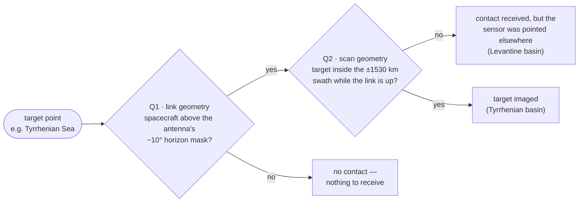
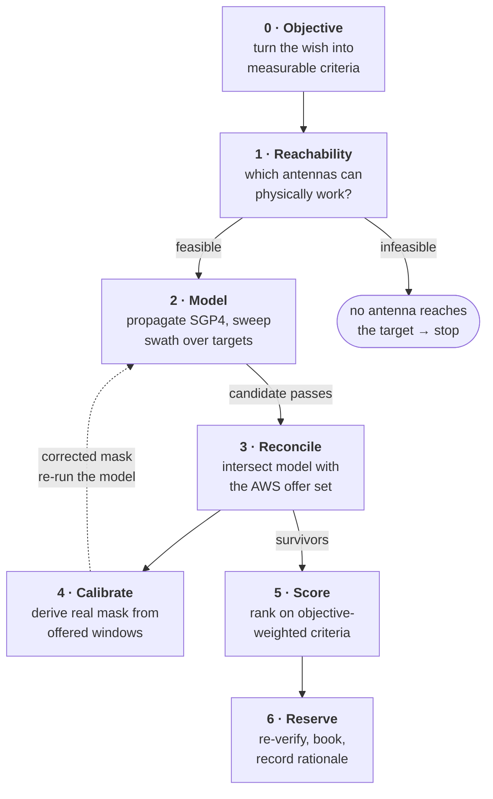
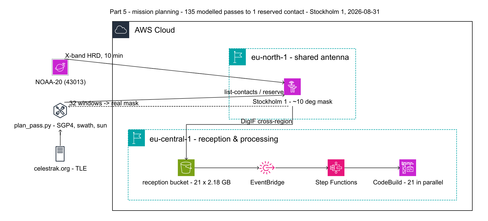
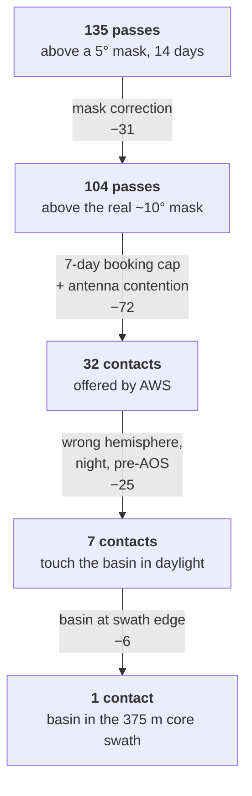
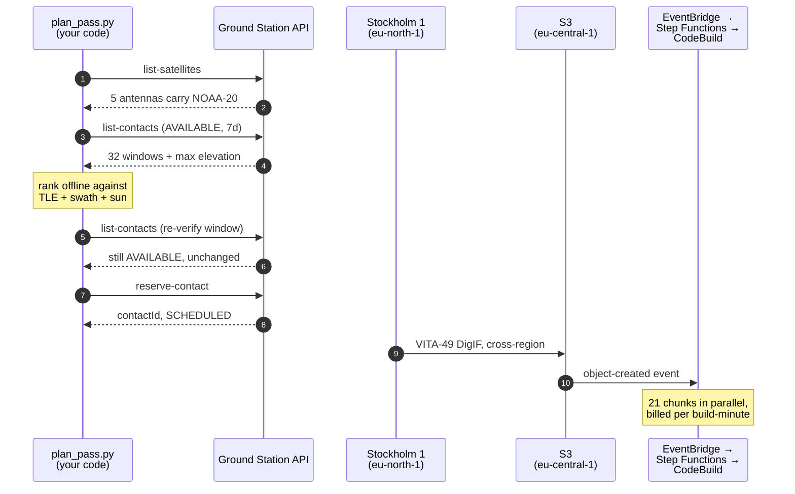

# Aiming a Rented Antenna — Choosing the One Contact That Images Your Target

AWS will tell you when a satellite is above an antenna you don't own. It will not tell you what the instrument is looking at while it's up there. **Closing that gap is the entire job** — and it is the part you have to build yourself.

| Objective | Candidates modelled | Offered by AWS | Met the objective | Cost of the answer |
|---|---|---|---|---|
| Mediterranean, daylight | 135 | 32 | 1 | ~$110 |

[Part 1](./article-1-cloud-opensource.md) and [Part 2](./article-2-nasa-software.md) take a *given* pass and turn it into geolocated imagery. This article is about the step before that: how a specific ten-minute contact gets chosen out of two weeks of orbital mechanics, and the reasoning behind each stage. The worked example is a NOAA-20 VIIRS acquisition over the Mediterranean, but the method holds for any real-time direct-broadcast payload against any fixed area of interest.

The short version: **a satellite pass and a useful image are two different events**, governed by two different geometries, and a booking API only knows about one of them.

## The gap: two questions, one booking system

`ListContacts` answers a link-budget question: *is the spacecraft above this antenna's horizon mask?* That is the question AWS is in a position to answer, because it owns the antenna and knows the ephemeris.

Imaging a specific place asks a second, independent question: *is that place inside the instrument's swath?* VIIRS High Rate Data is a real-time broadcast — there is no onboard recorder to dump. Whatever the sensor scans while the link is up is what you get, and nothing else. Miss the overlap by ninety seconds and you have paid full price for a beautiful picture of somewhere else.



**Fig 1** — The radio link and the instrument swath are independent cones that happen to share a satellite. `ListContacts` evaluates Q1 only. A target can be missed not because the link dropped, but because the sensor was never pointed there while it was up.

Everything below exists to compute the intersection of those two cones, over time, and rank what falls inside it.

## Method: six stages, one feedback loop

The stages are ordered by cost of being wrong. Reachability is settled before any modelling, because if no antenna in the account can see the target, nothing downstream matters. Calibration sits deliberately *after* first contact with the API, because the model's most important parameter cannot be known until real data comes back.



**Fig 2** — Stages 0, 2 and 5 run entirely offline against a TLE; stages 1, 3, 4 and 6 require the AWS API. The dashed edge is the one that matters most — the offer set is what tells you your model was wrong, so stage 4 feeds back into stage 2 before any money is committed.



**Fig 3** — Where the work runs. Everything inside the cloud boundary is managed: the shared antenna in `eu-north-1`, the cross-region DigIF delivery, and the reception pipeline that [Part 1](./article-1-cloud-opensource.md) describes. `plan_pass.py` sits outside it, and so does the TLE it propagates — AWS supplies neither. The dashed return path is stage 4: the offered windows come back as a measurement of the antenna's real horizon mask.

## Stage 0 — Make the objective measurable

The brief was "a beautiful image of the Mediterranean, full day, lots of granules — and ideally pick out individual ships." That is four criteria wearing one coat, and two of them are in direct conflict.

| Stated wish | Measurable criterion | Optimum |
|---|---|---|
| Mediterranean | sub-basins inside swath while link is up | maximise count |
| "beautiful" | cross-track distance from nadir | < 1000 km (375 m I-band) |
| "full day" | solar elevation at target | > 40° |
| "lots of granules" | contact duration ÷ 85.4 s | maximise |
| ships / wakes | sun glint angle at target | 15–30° |
| clean true colour | sun glint angle at target | > 40° |

The last two rows are the same measurement pulling opposite ways. Sunglint is the specular reflection of the sun off water: inside the lobe, flat sea turns to mirror and wake turbulence shows as contrast — and your true-colour composite turns into a white blur. You cannot have both in one acquisition. Naming that conflict at stage 0 is what stops it from being discovered at stage 5 as an unexplained scoring tie.

**Where the objective breaks against physics.** "Pick out individual ships" does not survive contact with the instrument. A VIIRS I-band pixel is 375 m at nadir — **140,625 m² of sea per pixel**. Even the largest merchant vessels, around 400 m long and 60 m in the beam, fill under a fifth of that. Over calm dark water that is enough to lift one mixed pixel above the background, so a large ship can produce a single anomalous bright pixel. It cannot produce a shape, and one bright pixel is indistinguishable from a whitecap or a small cumulus. Say this at stage 0, not after the invoice. The honest alternative is Sentinel-2 at 10 m, free on the AWS Registry of Open Data, where the same vessel is a recognisable 40 × 6 pixel object.

## Stage 1 — Bound the problem before modelling it

Two nested constraints decide feasibility, and they are cheap to evaluate. Do them first.

**Constraint A — commercial.** Which antennas is this satellite actually onboarded for, in this account? One API call, and it is a hard boundary:

```
aws groundstation list-satellites
# NOAA-20 (43013) → Cape Town 1, Hawaii 1, Ohio 1, Oregon 1, Stockholm 1
```

Five antennas. Note what is *not* there: no Bahrain, which would have been the natural choice for the eastern Mediterranean. That absence is not negotiable and it removes a third of the target area before a single line of orbital mechanics is run.

**Constraint B — geometric.** For each surviving antenna, how far can it reach? The ground range to a satellite at altitude `h` seen at elevation angle `E` follows from the central angle:

```
γ = arccos( R / (R+h) × cos E ) − E
range = γ × R                     R = 6371 km, h = 833 km

E =  5°  →  2574 km        E = 10°  →  2155 km
E = 20°  →  1526 km        E = 30°  →  1112 km
```

Add the instrument's cross-track reach — VIIRS scans ±56.28°, giving ±1530 km — and the total reach from an antenna is roughly `range(E_mask) + 1530 km`. Stockholm sits 1550–3100 km from the Mediterranean basin, so the western and central basins fall inside and the eastern basin does not. That single sum decided the whole campaign, and it took a pocket calculator.

> **Business value at this stage.** Answering "can I image X?" cost two API calls and five minutes. The equivalent question for owned infrastructure is a site survey. **The ability to cheaply prove infeasibility is worth as much as the ability to acquire** — it is the difference between a five-minute no and a six-month no.

## Stage 2 — Model the swath, not just the pass

This is the part AWS does not provide and you must write. Roughly 400 lines of Python ([`scripts/plan_pass.py`](../scripts/plan_pass.py)), no dependencies beyond `sgp4` and `requests`:

1. **Propagate.** Fetch the current TLE, run SGP4 at a 5–15 s cadence over the planning horizon. Convert TEME → ECEF through GMST, then to geodetic sub-points.
2. **Find windows.** Compute topocentric elevation from the ground station; a window is a run of samples above the mask.
3. **Sweep the swath.** For each target point, find the minimum great-circle distance to the sub-track *within the window*. That minimum is the cross-track distance at closest approach.
4. **Reject edge cases.** If the closest approach lands on the first or last sample, the target's scan line falls outside the contact — the swath was still sweeping toward it when the link opened. Not covered.
5. **Add solar geometry.** Solar position, then zenith and azimuth at each target at its own imaging time. Glint angle follows from the sun and view vectors.

Step 4 is the one that separates a real answer from a plausible one. Without it the model happily reports coverage of basins that were scanned ninety seconds before acquisition of signal — geometrically inside the swath, physically never transmitted to you.

**Trap.** The AWS CLI renders contact timestamps with the *caller's local UTC offset*, not `Z`. Parsing with `fromisoformat().replace(tzinfo=None)` silently strips two hours in CEST and puts your sub-tracks over the Pacific. It looks like a physics bug and it is a timezone bug. Always `.astimezone(timezone.utc)`.

## Stage 3 — Reconcile the model against what AWS will sell

A propagator computes what the universe permits. `ListContacts` reports what a shared commercial antenna will actually sell you, and the two sets differ in ways no amount of orbital mechanics predicts.



**Fig 4** — Attrition from geometry to bookable answer, with the cause of death on each edge. The largest single loss is not physics — it is the 7-day booking cap combined with contention for a shared antenna.

Two discoveries here had no offline signal whatsoever:

- **A 7-day booking horizon.** `ListContacts` returns `ResourceLimitExceededException` beyond it. Four of the best-scoring modelled passes were simply not purchasable.
- **Contention.** Several geometrically excellent passes *inside* the 7-day window were absent from the offer set. Stockholm 1 is shared, and those slots belong to someone else. You are a tenant.

The operational rule that follows: **plan against the offer set, never against a propagator alone.** The propagator's job is to rank what AWS offers, not to generate a wish list.

## Stage 4 — Let the API calibrate the model

The horizon mask is the model's most sensitive parameter and its least knowable one. AWS does not publish it. I started at 5°; the previously flown contacts implied something nearer 19°. Those two assumptions differ by 400 km of reach and two whole sub-basins of coverage.

The offer set settles it empirically. Propagate the TLE through all 32 offered windows and evaluate the elevation at each boundary:

```
window edges, 32 offered contacts, Stockholm 1
  min  8.93°      median 10.47°      max 26.43°
  → edges cluster tightly in 9.0–11.0°
  → outliers are windows truncated by adjacent bookings
```

The real mask is ~10°. This is the highest-leverage stage in the method and it costs nothing: it converts a guessed constant into a measured one, and it simultaneously validates the propagator — my computed windows reproduced AWS's to within about a degree, which is the evidence that the ground-station coordinates and the TEME→ECEF chain are right.

> **Business value at this stage.** The API is a free, continuously updated source of truth about infrastructure you don't own and can't inspect. **Treat every AWS response as a measurement, not just a result.** Thirty-two contact windows you never book still tell you the antenna's mask, its contention level, and whether your physics is right.

## Stage 5 — Score against the objective, and find the coupling

Seven offered contacts touched the basin in daylight. Ranking them exposed a structural coupling that is invisible until the data is plotted — and which decides the answer.

NOAA-20 ascends northward across Europe, and its ground track drifts west as it climbs. A pass well centred on the Mediterranean at 40°N is therefore displaced far west of Stockholm by 59°N, giving a low maximum elevation. A pass that climbs directly over Stockholm was necessarily far to the east over the basin, putting the Mediterranean at the outer edge of the swath. **One orbital fact produces both effects, and their optima are eleven degrees of longitude apart.**

```
  image quality  (cross-track, lower better) ────▼──────────────────  best near 15°E
  link  quality  (max elevation, higher better) ───────────────▲────  best near 26°E

  0°E                     15°E                 26°E                38°E
                           └───── 11° of longitude ─────┘

           longitude of ascending sub-track at acquisition of signal
```

**Fig 5** — The two quality metrics peak at different points along the same axis. Every pass that gave a strong downlink put the Mediterranean 1000–1400 km off nadir, where the I-band ground sample degrades from 375 m to roughly 800 m. Exactly one offered contact sat on the useful side.

| Contact (UTC) | Sub-track | Max el. | Basins | In core | Median off-nadir | Best glint |
|---|---:|---:|---:|---:|---:|---:|
| 03 Sep 12:44 | 3.5°E | 25.8° | 2 | 2 | 810 km | 28.5° |
| **31 Aug 11:59** | **15.2°E** | **47.5°** | **5** | **4** | **428 km** | **28.3°** |
| 02 Sep 11:21 | 24.5°E | 80.6° | 5 | 2 | 1014 km | 62.1° |
| 28 Aug 11:15 | 25.9°E | 87.0° | 4 | 2 | 1140 km | 65.4° |
| 03 Sep 11:03 | 28.9°E | 79.8° | 4 | 1 | 1388 km | 74.0° |
| 29 Aug 10:56 | 30.4°E | 73.6° | 3 | 0 | 1224 km | 75.4° |
| 30 Aug 10:38 | 34.6°E | 57.4° | 1 | 0 | 1392 km | 81.5° |

Scoring weights coverage first, then core-swath placement, then illumination, link elevation *while the basin is being scanned*, and duration. That fourth term matters more than the pass maximum: the Mediterranean is scanned in the opening ninety seconds at 11–17° elevation, at maximum slant range, which is precisely where earlier contacts lost packets and produced partial granules.

## Stage 6 — Re-verify, reserve, record

Availability is not a lease. Between ranking and booking, another tenant can take the slot — so re-query the exact window immediately before committing, confirm the elevation and boundaries are unchanged, then reserve and confirm the state transition.



**Fig 6** — The managed path. Steps 1–8 are the planning loop; everything after `reserve-contact` runs without further intervention — the antenna in `eu-north-1` delivers to a bucket in `eu-central-1` and the arrival event fans the pipeline out, exactly as in [Part 1](./article-1-cloud-opensource.md). The only unmanaged component in the diagram is the ranking step, and that is the component this article is about.

Record the rationale with the booking. A contact ID alone tells a future reader nothing; the coverage table, the expected sub-track, and the criteria you optimised for are what make a disappointing result diagnosable rather than mysterious.

| Field | Value |
|---|---|
| Contact | `ba2c5446-280f-4985-8ad8-dced8ae8b616` |
| Window | 2026-08-31 · 11:59:49 → 12:10:20 UTC |
| Max elevation | 51.23° |
| Basins in core swath | 4 of 5 — Gulf of Lion, Ligurian, N. & S. Adriatic |
| Closest major port | Naples, 63 km off nadir |
| Expected volume | ~7.4 granules · ~21 × 2.18 GB |

## What AWS actually bought here

Stated plainly, with the costs alongside the benefits.

**Where it pays off**

- **Zero capex, zero siting.** A targeted X-band acquisition over an arbitrary AOI for ~$110 and an afternoon of engineering, against 12–18 months to build a station.
- **Geographic optionality.** Stockholm today, Hawaii next week. No single owner can place antennas on five continents for a demonstrator.
- **The whole loop is an API.** Feasibility, planning, booking and delivery are code. Pass selection becomes a script under version control, not a phone call — this is the real gain.
- **Managed cross-region dataflow.** Antenna in `eu-north-1`, bucket in `eu-central-1`, no ops.
- **Elastic downstream.** 21 chunks fan out in parallel and bill per build-minute; the pipeline costs nothing between contacts.
- **Cheap failure.** Proving the eastern Mediterranean unreachable cost two API calls.

**Where it costs or constrains**

- **You are a tenant.** Antenna contention silently removes excellent passes from the offer set. With your own dish, every pass over your horizon is yours.
- **A 7-day booking horizon** on this account makes campaign planning impossible; the best modelled geometry was routinely unpurchasable.
- **The onboarded antenna set is a hard wall.** No Bahrain for NOAA-20 means the eastern basin cannot be imaged at any price.
- **AWS tells you nothing about your target.** The mission-planning layer is entirely yours to build, and it is the expensive part.
- **Undocumented operating parameters.** The horizon mask had to be reverse-engineered from offered windows.
- **Per-contact cost is linear.** Nothing amortises; contact 500 costs what contact 1 did.

### Build versus rent, parametrically

The linear cost is the crux for anyone considering sustained operations, so it is worth modelling rather than asserting.

```
 $140k ┤                                                 ╱   AWS = $130 × contacts
       │                                             ╱
       │                                         ╱
  $73k ┼───────────────────────────────●─────╱─────────── owned station ≈ $73k/yr fixed
       │                          ╱
       │                     ╱
       │                ╱
    $0 ┼───────────╱────────────────┬───────────────────
       0                           560                1000
              rent            break-even      consider building
                            (≈ 11 per week)

                          contacts per year
```

**Fig 7** — Illustrative, not a quotation. Assumes $130 all-in per 10-minute contact (observed), and an owned 3.7 m X-band station at ~$300k capex over 7 years plus ~$25k/yr operations — planning figures, not vendor prices. Substitute your own and the shape holds: **below roughly ten contacts a week, renting wins decisively.**

The break-even number is not the interesting conclusion, though. For this specific objective the honest verdict cuts differently: **a single owned antenna in Malta or Cyprus would beat AWS outright** — full basin coverage including the eastern Mediterranean that AWS cannot reach at any price, every pass, no contention, no booking horizon. AWS wins decisively on global reach and zero commitment. It loses on a single fixed AOI at high cadence. Which of those describes the workload is the question that should drive the decision, and it is not a cost question.

## The method, transferable

Stripped of the Mediterranean specifics, for any real-time direct-broadcast payload and any fixed AOI:

1. Decompose the objective into measurable criteria. Surface conflicts between them now — they will not resolve themselves later.
2. Check the instrument's resolution against the smallest thing you want to see. Kill impossible objectives before they cost money.
3. List onboarded antennas. This is a hard commercial boundary, not a starting point for negotiation.
4. Compute `range(E_mask) + swath_half_width` for each. Discard antennas that cannot reach.
5. Propagate, sweep the swath over target points, reject closest approaches pinned to a window edge.
6. Pull the real offer set. Intersect. Accept that it is much smaller than the geometry allows.
7. Derive the mask from the offered windows. Re-run the model with the measured value.
8. Plot your quality metrics against a common orbital axis and look for coupling before you score.
9. Re-verify availability immediately before reserving.
10. Commit the rationale next to the booking.

The propagator was four hundred lines. The insight it produced — that link quality and image quality peak eleven degrees of longitude apart, so exactly one of thirty-two purchasable contacts could satisfy the brief — is not something the booking API could ever have surfaced, because the booking API is not in the imaging business.

**AWS Ground Station removes the antenna from the problem. It does not remove the mission planning, and that was always the harder half.**

## Postscript — the contact flew

Contact `ba2c5446` executed on 2026-08-31 at the modelled 51.23° maximum elevation. Delivery was clean: 22 `.pcap` chunks, 43.1 GiB, a gapless 30-second cadence from 28 seconds after AOS to 19 seconds after LOS. Demodulation was clean too — 22 CADU files, then RT-STPS produced five Level 0 RDRs including a 639.5 MiB VIIRS RDR holding **8 science granules**.

Then CSPP calibrated exactly one of them.

| Product | Granules | Earliest coverage (UTC) |
|---|---:|---|
| Terrain-corrected geolocation (`GITCO`/`GMTCO`/`GDNBO`) | 4 | 12:02:20 |
| Calibrated radiances (`SVI01`–`SVM16`, `SVDNB`) | **1** | 12:06:35 |

AOS was 11:59:49, and the Mediterranean is scanned in the **first 10–115 seconds** of this contact. The one calibrated granule begins 6 minutes 46 seconds after AOS, over Scandinavia. **No calibrated product, and no geolocation, covers the basin.** The early granules failed inside CSPP with `SDR_PREREQ_ABSENT VIIRS-SCIENCE-RDR` — the science RDR was too incomplete to calibrate.

The uncomfortable part is that the method predicted this. Stage 5 weighted "link elevation *while the basin is being scanned*" above the pass maximum precisely because the Mediterranean is scanned at 11.6–17.4° elevation at maximum slant range, "which is precisely where earlier contacts lost packets and produced partial granules." The scoring named the risk, ranked the pass first anyway because every alternative was worse, and the risk materialised.

That is the honest boundary of planning against a rented antenna at the edge of its reach. The geometry was chosen correctly and the link budget still lost. **Cost per contact is linear, so a second attempt costs the same as the first** — which is exactly the arithmetic that makes an owned antenna in Malta or Cyprus, where the basin sits near zenith rather than at 11°, stop looking like a luxury.
