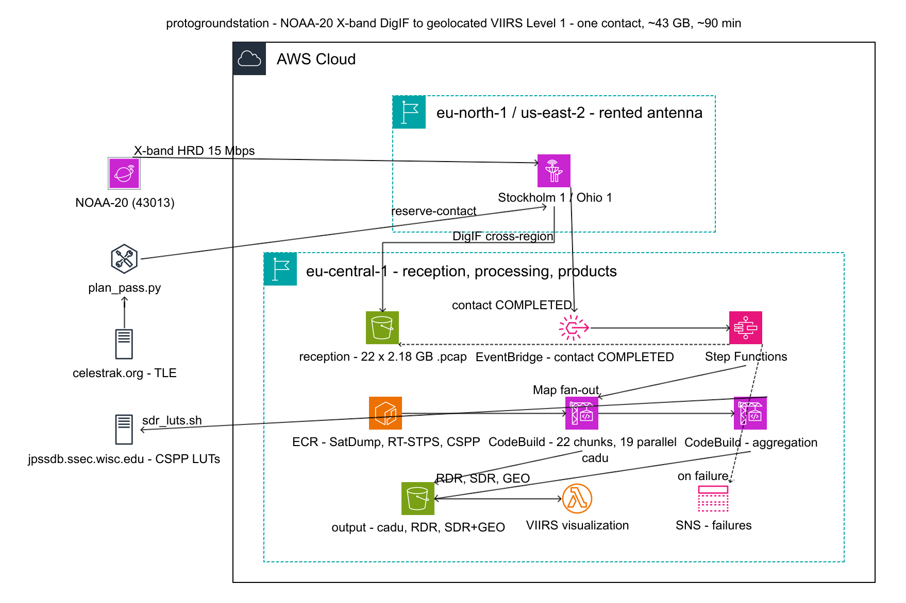
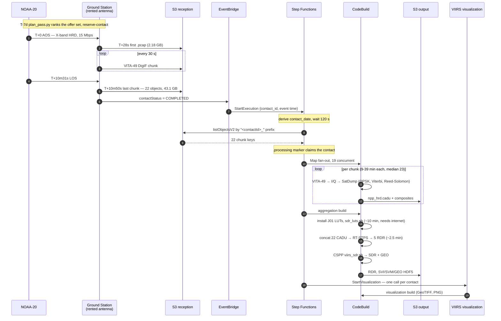
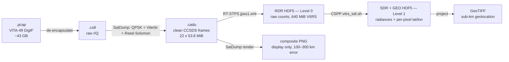

# Architecture

How a booked satellite contact becomes calibrated, geolocated imagery — the services, the
sequence, and the constraints that shaped both.

Diagram source: [`diagrams/architecture.yaml`](diagrams/architecture.yaml), rendered with
[awsdac](https://github.com/awslabs/diagram-as-code) — `awsdac docs/diagrams/architecture.yaml -o docs/diagrams/out/architecture.png -f`.

Everything inside the cloud boundary is managed. The three things outside it are the ones
AWS does not supply: the **orbital model** that decides which contact is worth buying
(`scripts/plan_pass.py`), the **TLE** it propagates, and the **CSPP calibration LUTs** that
turn raw counts into physical radiances.

---

## The cinematic — one contact, end to end

Times are relative to AOS, measured on contact `ba2c5446` (2026-08-31, Stockholm 1,
10m31s). Total wall-clock from AOS to Level 1 is roughly **100 minutes**, of which the
pass itself is ten.

### Where the time goes

| Stage | Duration | Note |
|---|---|---|
| Contact | ~10 min | the only part that costs antenna time (~$110) |
| Delivery settle | 120 s | last chunk landed 19 s after LOS; the wait is margin |
| Chunk fan-out | ~40 min | 22 builds, 19 concurrent; measured 8.7 / 23.3 / 38.9 min (min / median / max) |
| Aggregation | ~25 min | ~10 of it is `sdr_luts.sh` fetching ancillary |

---

## The processing chain

Each step strips a container or adds meaning; nothing is thrown away until the end.

The lower branch is what open source alone gives you; the upper branch is why the NASA
stack is worth the trouble. See [`../articles/article-2-nasa-software.md`](../articles/article-2-nasa-software.md).

---

## Step Functions state machine

`groundstation-noaa20-sdr-pipeline`, defined in
[`../infra/modules/sdr_pipeline/step_functions.tf`](../infra/modules/sdr_pipeline/step_functions.tf).

| State | Type | Purpose |
|---|---|---|
| `DeriveDateOnly` → `DeriveDateParts` → `BuildContactDate` | Pass | event timestamp → `2026/09/06`; three states because Step Functions rejects deeply nested intrinsics |
| `WaitForDelivery` | Wait | 120 s, so the last chunk has landed |
| `ListChunks` | Task | `s3:listObjectsV2` prefixed `"<contactId>_"` |
| `ShapeInput` | Pass | normalise to `{contact_id, bucket, contact_date, chunks[]}` |
| `CheckChunksFound` | Choice | fail loudly on an empty contact |
| `CheckProcessingMarker` / `WriteProcessingMarker` | Task | idempotence via `contacts/{id}/.processing` |
| `ParallelProcessing` | Map | 19 concurrent, `ToleratedFailurePercentage: 100` |
| `StartAggregationBuild` … `EvaluateAggregation` | Task/Wait/Choice | CodeBuild aggregation, polled |
| `StartVisualization` | Task | invokes the VIIRS orchestrator directly — one call per contact. Catches `States.ALL` to success: products are already in S3, so a visualisation failure must not fail the run |
| `MarkAggregationFailed` → `AggregationFailure` | Pass/Task | populate `$.error`, publish to SNS |

**A green execution does not mean 22 good chunks.** The Map tolerates 100 % failure by
design, so partial results still reach aggregation. Check the per-chunk `build_status`.

**A green execution does not mean imagery either.** `StartVisualization` catches to
success, so a failed rendering leaves `products/{date}/{contact}/` empty while the
execution reports `SUCCEEDED`. Three rehearsals did exactly that on 2026-09-01. Verify
against the products prefix, never the execution status.

---

## Constraints worth knowing before changing anything

- **CSPP needs the internet; the EC2 aggregation instance does not have it.** Its security
  group is SSM-outbound-only, so `sdr_luts.sh` times out and CSPP dies inside its own error
  handler. Aggregation therefore runs in CodeBuild. See [`DEPLOYMENT.md`](DEPLOYMENT.md).
- **The trigger is per contact, not per object.** A pass writes ~22 objects over ~10
  minutes; an execution started by the first cannot know the full list.
- **S3 allows one notification configuration per bucket.** Two `aws_s3_bucket_notification`
  resources on one bucket silently erase each other — that is how EventBridge ended up
  disabled and a whole pass went unprocessed.
- **The contact id is in the object *name*, not a path segment:**
  `year=Y/month=M/day=D/satellite=<sat>/<contactId>_<ts>_<uuid>.pcap`.
- **Re-running a contact accumulates products.** RDR and SDR filenames embed a creation
  timestamp, so they never overwrite; only `.cadu` does.
- **The visualisation buildspecs live in the Lambda, not in `buildspecs/`.** The CodeBuild
  project is `NO_SOURCE` with a stub spec that exits 1; the real spec is passed as
  `buildspecOverride` at `start_build()` time from
  [`lambdas/viirs_visualizer/handler.py`](../lambdas/viirs_visualizer/handler.py). The
  `buildspecs/viirs_*.yml` files are manual-run copies and are *not* what runs. Three
  defects hid in that gap until 2026-09-01: a wrong script path, the NASA path reading
  `chunks/` instead of `sdr/` under pre-J01 filenames, and a SatDump sync that produced a
  nested tree the non-recursive composite discovery could not see.
- **SatDump georeferences its own composites; we do not.** It ships the VIIRS scan
  model (`resources/projections_settings/jpss1_viirs.json` — aggregation zones in
  `forced_gcps_x`, 112° scan, `roll_offset` -0.05, `yaw_offset` 0.15) and holds the
  per-scan timestamps inside the product, so it raytraces every line with the right
  pointing. Adding a `project` block to a composite in `satdump_cfg.json` makes it
  write `rgb_<name>_projected.tif`, an equirectangular GeoTIFF; that is done at image
  build time by [`docker/sdr-pipeline/enable_satdump_projection.py`](../docker/sdr-pipeline/enable_satdump_projection.py),
  and `scripts/viirs/projected_reader.py` reads them. The GeoTIFF carries its own
  extent, so nothing downstream needs to know any geometry.
- **`scripts/viirs/scan_geometry.py` is a deprecated fallback**, used only for products
  decoded before projection was enabled. It reconstructs SatDump's model from outside
  and is less accurate: it cannot apply the roll/yaw corrections, and it rebuilds line
  times from a rate where SatDump has the real per-scan timestamps. Three things in it
  are still worth knowing, because they are documented nowhere: the CBOR ephemeris
  timestamps are 2³² s low; the frame they describe was rotated with that *wrapped*
  clock, so undoing it needs the raw stamp; and the composite is cropped relative to
  the bands whose timestamps it carries. Do not extend it — fix the SatDump config.
- **SatDump output is per chunk, not per contact.** Composites live at
  `satdump/chunk_N/<INSTRUMENT>/`, one set per 30 s of downlink. `chunk_0` is the first
  30 s after AOS. The visualiser globs a flat directory, so the buildspec stages the
  per-chunk folders into one, lowest chunk number winning.
- **Visualisation is told, not triggered.** It was once driven by an S3 `ObjectCreated` rule
  matching `.png`; a contact writes ~9,150 objects, so arming that bucket produced ~6,000
  CodeBuild builds in a morning and exhausted the account build queue. Nothing this pipeline
  writes is one-per-contact, so no filter fixes it — the state machine calls the orchestrator.
- **The EC2 aggregation instance carries a hand-installed `/opt/rt-stps` and
  `/opt/SDR_4_1`** that exist in no Terraform, Dockerfile or user_data. Replacing the
  instance destroys them, which is why `ignore_changes` covers `root_block_device`.

---

## Cost per contact

| Item | Approx. |
|---|---|
| Antenna time (10 min, on-demand) | $110–130 |
| CodeBuild (~490 build-minutes: 471 chunks + ~22 aggregation) | the largest variable |
| Cross-region transfer (43 GB) | ~$1 |
| S3 storage | ~$1/month per retained pass |

DigIF delivery is the reason the numbers are this size: it ships ~30× the demodulated
bitstream. AWS also offers demodulated delivery — cheaper, if implementing the signal chain
is not the point.
