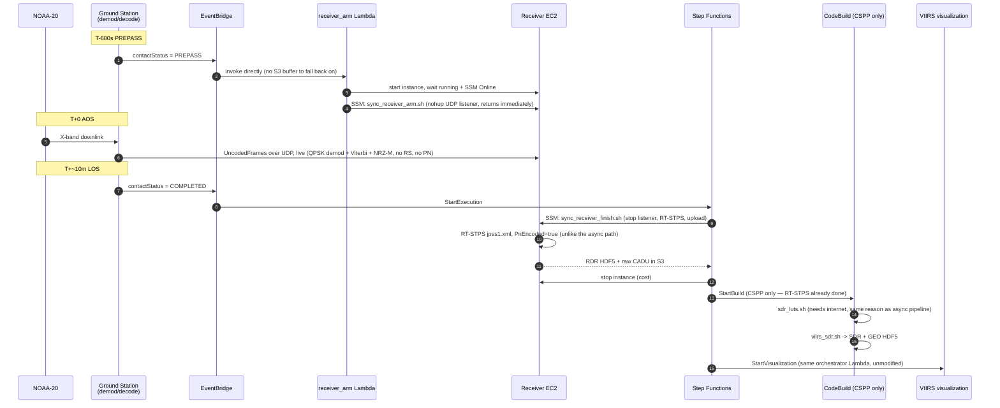

# Synchronous pipeline — live demod/decode reception

A second, independent reception path for NOAA-20, alongside the DigIF pipeline described
in [`ARCHITECTURE.md`](ARCHITECTURE.md). Not yet flown — this documents the design as
built, consolidated from the header comments across
[`infra/modules/sync_pipeline/`](../infra/modules/sync_pipeline/),
[`lambdas/receiver_arm/`](../lambdas/receiver_arm/) and `scripts/sync_receiver_*`.

## Why a second pipeline

The existing pipeline receives **DigIF** — raw digitized RF, undemodulated. That is why
one 10-minute contact is ~43 GB: DigIF ships roughly 30× the actual demodulated bitstream
(see `ARCHITECTURE.md`'s cost table). AWS Ground Station can instead demodulate and
FEC-decode on the antenna side and deliver the much smaller decoded-frame stream live,
during the contact — `AntennaDownlinkDemodDecodeConfig`. This pipeline exercises that
path: a dedicated mission profile, a receiver EC2 that the decoded stream is delivered
to over UDP in real time, and a much shorter post-contact chain (no S3 chunk fan-out,
because there's nothing to fan out — RT-STPS runs once, on the receiver, right after LOS).

**Fully separate from the async pipeline at every layer** — its own mission profile,
dataflow endpoint, EventBridge rules, Step Functions state machine, IAM roles, S3 bucket,
and CloudWatch alarms. Nothing in `modules/sdr_pipeline` or `modules/mission_profile` was
touched. The only thing it reuses is the SDR pipeline's ECR image, for the CSPP-only
aggregation build (`sdr_pipeline_ecr_repository_url` output).

## Architecture



## Component reference

| Layer | Resource | File |
|---|---|---|
| Ground Station config | `AntennaDownlinkDemodDecodeConfig` (QPSK, Viterbi 1/2, NRZ-M, `UncodedFramesEgress`), tracking config, dataflow endpoint config, mission profile `noaa20_sync` | [`groundstation.tf`](../infra/modules/sync_pipeline/groundstation.tf) |
| Receiver network | Dedicated EC2 + SG (UDP ingress from Ground Station's managed prefix list only, HTTPS egress for SSM/S3), dataflow endpoint group bound to its ENI | [`ec2.tf`](../infra/modules/sync_pipeline/ec2.tf) |
| Pre-AOS arm | `receiver_arm` Lambda: start EC2, poll running + SSM Online, `SendCommand` to arm the listener | [`lambda.tf`](../infra/modules/sync_pipeline/lambda.tf), [`lambdas/receiver_arm/handler.py`](../lambdas/receiver_arm/handler.py) |
| Live listener | UDP socket bound before AOS, strips a VITA-49-style header per packet, writes the decoded CCSDS frame stream to disk | [`scripts/sync_receiver_listen.py`](../scripts/sync_receiver_listen.py) |
| Post-LOS handoff | Stop listener, run RT-STPS locally, upload CADU + RDR to S3 | [`scripts/sync_receiver_finish.sh`](../scripts/sync_receiver_finish.sh) |
| Orchestration | Step Functions: wait, `FinishReceiver` (SSM), poll, stop EC2, CSPP CodeBuild, poll, `StartVisualization` | [`step_functions.tf`](../infra/modules/sync_pipeline/step_functions.tf) |
| Aggregation | CSPP-only CodeBuild project, reuses `sdr_pipeline`'s ECR image | [`codebuild.tf`](../infra/modules/sync_pipeline/codebuild.tf), [`buildspecs/aggregation_sync.yml`](../buildspecs/aggregation_sync.yml) |
| Triggers | PREPASS → Lambda direct invoke; COMPLETED → state machine. Both filtered on this module's `missionProfileArn` | [`eventbridge.tf`](../infra/modules/sync_pipeline/eventbridge.tf) |
| Alarms | EC2 status checks (with auto-recovery), Lambda errors, Step Functions failures → shared SNS topic | [`monitoring.tf`](../infra/modules/sync_pipeline/monitoring.tf) |

## What is materially different from the async pipeline

- **No S3 buffer.** The async pipeline can recover from a late Lambda because chunks sit
  in S3 regardless. Here the receiver must be running and its listener bound *before*
  AOS or the pass is lost outright — hence the 600 s `contact_pre_pass_duration_seconds`
  budget (up to 240 s for EC2 running, 120 s for SSM agent registration, plus margin) and
  the dedicated alarms in `monitoring.tf`.
- **`PnEncoded="true"`, not `"false"`.** The async pipeline's SatDump step already
  derandomizes PN before RT-STPS ever runs. `UncodedFramesEgress` does not — no
  Reed-Solomon, no PN — so RT-STPS here must do both, the opposite configuration from
  `scripts/aggregation.sh`. Get this backwards and RT-STPS silently discards every frame
  (XORing already-clean data back into noise), the same failure mode documented in
  `ARCHITECTURE.md`'s PN note.
- **RT-STPS runs once, on the receiver, not fanned out in CodeBuild.** There is one
  combined capture file per contact, not 22 chunks — nothing to parallelize.
- **CSPP is the only CodeBuild stage.** RT-STPS is done by the time the state machine's
  aggregation step starts.
- **Packet format is not fully verified.** See the open risk below.

## Open risk — packet format unverified

`scripts/sync_receiver_listen.py` assumes the demod/decode `UncodedFramesEgress` stream
uses AWS's "VITA-49 Extension" format with the *same* 4-byte big-endian header layout as
the DigIF "VITA-49 Signal Data/IP Format" reference in `scripts/vita49_extract.py`
(7-word/28-byte header, type in top 4 bits, size in low 16 bits). AWS documents that these
two formats are explicitly different and that the exact layout is provided during
satellite onboarding, not published. **This has not been validated against real traffic.**

If RT-STPS's `frame_sync` fails to lock on the first real capture, the fix is not to
re-guess the header — capture a short sample with `sync_receiver_listen.py --raw-passthrough`
and inspect it by hand against the onboarding-provided spec. The C/T/TSI/TSF flag bits
can change the header length by up to 5 words, which the fixed 7-word assumption does not
account for.

## Manual prerequisites (installed by hand, outside Terraform)

Same pattern as the existing aggregation EC2 (`ARCHITECTURE.md`'s constraints section):
`ec2.tf` deliberately ships no `user_data`. Before the first test, the receiver instance
needs, copied to the paths the scripts expect:

| Path | Contents |
|---|---|
| `/opt/scripts/sync_receiver_arm.sh`, `sync_receiver_finish.sh` (executable) | this repo's `scripts/` |
| `/opt/scripts/sync_receiver_listen.py` | this repo's `scripts/` |
| `/opt/rt-stps/` | RT-STPS 7.0 + Patch 1, `config/jpss1.xml` with `PnEncoded="true"` (the **default**, unmodified template — do not apply the async pipeline's PN patch here) |

## Enabling it

```hcl
# infra/terraform.tfvars
enable_sdr_pipeline  = true   # required — sync_pipeline reuses its ECR image
enable_sync_pipeline = true
```

`terraform apply` then creates a second, independent mission profile
(`noaa20_sync`) alongside the existing async one. Both can be enabled simultaneously
against the same satellite.

## Choosing which pipeline runs for a given contact

**The mission profile ARN you reserve the contact against decides everything downstream.**
Both pipelines' EventBridge rules filter on `detail.missionProfileArn`
(`eventbridge.tf` in each module), so a contact reserved under one mission profile never
triggers the other's state machine.

```bash
# Async (DigIF) — existing pipeline
terraform -chdir=infra output mission_profile_arn

# Sync (demod/decode) — this pipeline
terraform -chdir=infra output sync_pipeline_mission_profile_arn
```

To fly the sync pipeline, pass the **sync** ARN to both `list-contacts` (so the offered
windows reflect this mission profile's tracking config) and `reserve-contact`:

```bash
MP_SYNC=$(terraform -chdir=infra output -raw sync_pipeline_mission_profile_arn)
# satellite_id is the UUID in terraform.tfvars; build the ARN the same way
# existing manual reserve-contact calls do (see docs/CONTACTS.md)
SAT="arn:aws:groundstation:eu-central-1:471112743408:satellite/33f035e1-73f7-47a5-9df8-fbc48636dca8"

aws groundstation list-contacts --status-list AVAILABLE \
  --ground-station "Stockholm 1" --mission-profile-arn "$MP_SYNC" --satellite-arn "$SAT" \
  --start-time <now> --end-time <now+7d> > contacts_sync.json

aws groundstation reserve-contact \
  --mission-profile-arn "$MP_SYNC" --satellite-arn "$SAT" \
  --ground-station "Stockholm 1" \
  --start-time <aos> --end-time <los>
```

Reserving against the async mission profile ARN (the existing `mission_profile_arn`
output) runs the DigIF pipeline exactly as before — the two are independent per-contact,
not a global switch.
